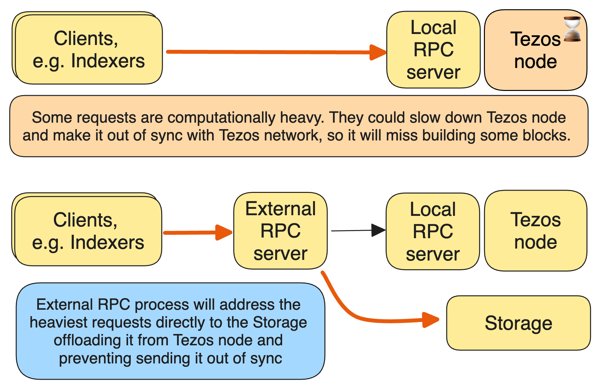

JSON/RPC interface
==================

Overview
--------

The Octez node provides a JSON/RPC interface. Note that it is an RPC
interface, and it is JSON based, but it does not follow the “JSON-RPC”
protocol.

Some RPC calls are computationally intensive. They can slow down the node
and even temporarily block synchronization with its peers and get the
node out of sync.

The JSON/RPC interface is not active by default mainly for security reasons.
The operator should be explicit about exposing endpoints and possibly
add a whitelist if necessary.
See :ref:`default_acl` for limiting access to certain RPCs.
Another reason is the potential performance impact.
See :ref:`activating_rpc` section.

To address the problem of heavy RPC requests, the RPC interface can be
activated in two different modes.

- Local RPC server: this server operates in the same process as the
  Octez node and serves data directly from the node.
- External RPC server: this server operates in a separate process and
  forwards requests to the Local RPC server. However, some RPC
  requests are handled directly by the External RPC server, which we
  refer to as being handled locally. This mode prevents the node from
  blocking.

The RPC interface is typically used in one of the two use cases referred
as Baking setup and Service provider setup.

Baking setup:

- A private node
- Used by a Baker
- Time-critical setup; lagging means losing money as blocks cannot be built
- Only several RPC users
- Slow/heavy RPCs are very rare

Service provider setup:

- A fleet of public RPC nodes sharing the load
- Multiple external users, e.g., explorers, indexers, wallets, etc.
- Heavy load
- Slow/heavy individual RPC requests are probable and can significantly impact the service availability

In both cases, the total load generated by the RPC requests on the Octez node
is important. However, in baking setup the heavy individual RPC requests are
unlikely and thus enabling External RPC server will have minor or no benefit.
For a service provider, enabling the External RPC server is essential to ensure the node
remains in sync, thereby avoiding the risk of serving outdated answers if the node
gets stuck.

.. _activating_rpc:

Activating RPC
--------------

As mentioned before, the RPC interface is not active by default and it must be explicitly
activated.

For activating the Local RPC server mode, use the ``--rpc-addr`` option. In that case,
a local RPC server is started by the node at port ``8732``.

As an example, if you are not trying to run a public RPC node, but you
just want to explore the RPC interface on your own, you would run::

    ./octez-node run --rpc-addr localhost

To run an External RPC server, use instead ``--external-rpc-addr`` in
the command line. Then an External RPC server is started at port
``18731``.

::

    ./octez-node run --external-rpc-addr localhost

The RPC interface is self-documented and the ``octez-client`` executable
is able to pretty-print the RPC API. For instance, to see the API
provided by the Octez Shell::

    ./octez-client rpc list

To get API attached to the “genesis” block, including the remote
procedures provided by the associated economic protocol version::

    ./octez-client rpc list /chains/main/blocks/genesis

You might also want the JSON schema describing the expected input and
output of a RPC. For instance::

    ./octez-client rpc schema get /chains/main/blocks/genesis/hash

Note: you can get the same information, but as a raw JSON object, with a
simple HTTP request::

   curl -s localhost:8732/chains/main/blocks/head~10
   wget -O - http://localhost:8732/describe?recurse=true
   wget -O - http://localhost:8732/describe/chains/main/blocks/genesis?recurse=true
   wget -O - http://localhost:8732/describe/chains/main/blocks/genesis/hash

An online :doc:`index <../active/rpc>` of RPC calls is
also available.

The general call of an RPC from the client is ``octez-admin-client rpc
(get|post) <url>``.
For instance, if you wish to request the current balance of a given
block and contract, you can call the associated RPC via the command::

    octez-admin-client rpc get /blocks/<block_id>/proto/context/contracts/<contract_id>/balance

An RPC may take an *input* and generate an *output* both in JSON
format. For example, the previous RPC call, that does not require an
input, would display on the standard output::

    { "balance": "4000000000000" }

When calling an RPC that requires an input through command line, you will
be prompted to provide the JSON input
in your default configured text editor. Alternatively, you can provide
the JSON input using command

::

    octez-admin-client rpc post <url> with <JSON>

Don't forget to quote the JSON according to your shell rules.

.. _external_rpc_server:

External RPC server
-------------------

Thanks to this feature, the node won't experience slowdowns on computationally
intensive RPC calls. This significantly reduces the load on the Octez node and
prevents it from stopping synchronization with its peers or becoming out of sync. Additionally,
performance is expected to be slightly increased in terms of requests
handled per second. The External RPC server increases the latency for the RPC requests
by a negligible amount (less than 1 ms).

A benchmark framework, implemented in the
:src:`devtools/benchmarks-tools/bench_RPS/rps.sh` script,
allows to run performance evaluations easily. Along with
this benchmark framework, former results are stored in the dedicated
:src:`devtools/benchmarks-tools/bench_RPS/results.json` file.

RPC versions
------------

See :doc:`../introduction/versioning` and :ref:`RPC-versioning-dev`.

See also
--------

-  :doc:`rpc_architecture`
