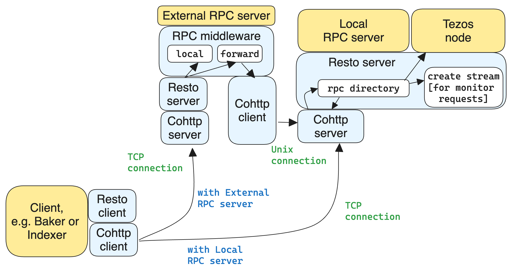

=========================
RPC handling architecture
=========================

The Cohttp library is a vendored component responsible
for handling HTTP requests and responses, providing the core functionality
for HTTP communication in both the Local and External RPC servers.

:src:`Resto<resto>` is a library for declaratively defining services,
binding them to given paths, and then either starting an RPC server
to serve the RPCs on these paths or making RPC calls to these services.
For monitoring requests, a stream is created and updates are sent out
as soon as new data is available.
Resto is responsible for the following:

- Providing primitives to describe services.
- Assembling the services into directories which are essentially maps of paths
  and methods to services.
- Spinning up a Cohttp server that serves the chosen directory.
- Making requests to services as a client. The client automatically builds
  paths based on parameters to the service, assembles other HTTP details,
  and parses the response.

Additionally, Resto provides features for configuring ACL and for serving
a self-description service - a service that describes all services of a directory.

In the rest of the document, we will use the term "Resto server" (as it is
called in the ``resto`` library), but it is worth clarifying that the Cohttp
server is the actual server which listens for events. Resto server is sitting
on top of Cohttp server, providing its handlers for events. Resto server is
not listening for events on its own but it handles the events.
So they split the functionality:

- Cohttp listens and involves event handlers
- Resto provides handlers for events

The :src:`RPC middleware<src/lib_rpc_http/RPC_middleware.ml>` module in
the External RPC server receives accepted connections
from the Resto server. Depending on the RPC type, it either handles the
underlying RPC request locally or forwards it to the Local RPC server next to the Tezos
node (they share the same PID) by initiating a connection to it. When forwarding, the RPC middleware
maintains a mapping between the accepted and the initiated connections. If
the client of the initial RPC request dies or closes a connection, the RPC middleware is notified by
Resto and then closes the corresponding initiated connection to the Local
RPC server.

RPC server initialization
=========================

Local RPC server and External RPC server are initialized at Tezos node start in
:src:`src/bin_node/node_run_command.ml`. Each of them calls ``launch`` in
:src:`src/lib_rpc_http/RPC_server.ml` for a Resto server.

An RPC server is declared in :src:`src/lib_rpc_http/RPC_server.ml` by ``Resto_cohttp_server.Server.Make``.
At launch, Resto RPC server takes 2 callbacks:

- ``callback`` - the main callback for accepted connections
- ``conn_closed`` - the callback notifying about the connection closed
  externally, e.g. by EOF

Resto server launches Cohttp server which also takes ``callback`` and
``conn_closed`` plus one more callback:

- ``sleep_fn`` - a callback implementing sleep with desired timeout which
  is used to listen for EOF while the main callback is unresponsive handling
  the request.

Resto provides a default ``callback`` implementation, ``resto_callback`` in
:src:`resto/src/server.ml`, which serves Resto directory.

The forwarding logic is handled in file :src:`src/lib_rpc_http/RPC_middleware.ml`
which defines ``proxy_server_query_forwarder``.

Connection management
=====================

The Client, Baker or Indexer can initiate RPC requests. As a result, a TCP
connection is established to the Tezos Node or to the External RPC server
depending on the settings in the Client, Baker or Indexer.

The External RPC server decides based on the RPC endpoint type if the request
has to be handled locally or should be forwarded to the Tezos node. For
performance reasons External RPC server tries to offload Tezos node.

If the request is forwarded, RPC middleware initiates a new request that is sent
to the Tezos node via an initialized Unix connection, using Cohttp client. From
now on, Cohttp client needs to monitor the connection health to notify the
Client/Baker/Indexer if the connection died.

This becomes critical as some requests are endless (e.g. ``/monitor/heads/main``
or ``/chains/main/mempool/monitor_operations``). The Client/Baker/Indexer have
no timeout for that and the responsibility of keeping these connections healthy
is on External RPC server.

The Cohttp server monitors the health of the Unix connection. If EOF is
received, RPC middleware is notified. Then it closes the connection towards the
Client/Baker/Indexer. See Cohttp functions ``handle_request`` and  ``wait_eof_or_closed``.

Cohttp uses Conduit library for low-level operation with connections. The Unix
file descriptor of the connection is kept within Cohttp and is hidden for higher
levels of the stack which makes debugging quite complicated. Cohttp server
passes the closing function to the Resto server allowing it to close the
connection if the forwarding operation failed.

The RPC server provides its callbacks to Cohttp which actually starts a server,
receives requests and involves the provided callbacks. RPC server launches
Cohttp as ``RPC_server.launch`` in :src:`src/lib_rpc_process/main.ml`. The
callback ``conn_closed`` takes a connection ID. This connection ID is provided
by Cohttp when the connection is created and then Resto stores it in forwarder
resources. Resto creates a new forwarded connection in
``make_transform_callback`` and stores the connection ID and a closing function
in ``forwarder_resources`` in :src:`src/lib_rpc_http/RPC_middleware.ml`.

The number of callbacks is confusing. So let’s take a closer look to
:src:`src/lib_rpc_http/RPC_middleware.ml`:

- Cohttp runs a server. So a connection request received from
  Client/Baker/Indexer/ arrives at Cohttp and then passed to Resto via
  ``make_transform_callback``.

- Resto passes the callback to Cohttp at server start to deal with a connection
  which has to be closed.
  As it is provided at server start, it takes connections storage and a
  connection ID as an input. The provided callback is essentially
  ``forwarding_conn_closed`` as it handles dead forwarded Unix connection.
  Therefore, Resto keeps a mapping of connections from Client/Baker/Indexer to
  the shutdown function on the corresponding forwarded connections towards the
  Tezos node. So if a client dies, the connection towards Tezos Node is also
  closed.

So when a connection from Client/Baker/Indexer is received, Resto is involved via  ``make_transform_callback``. And if that connection dies, Cohttp invokes ``forwarding_conn_closed``. If the connection is handled locally by External RPC server, Resto does nothing. If the request was forwarded, Resto will call ``shutdown`` for the Unix connection towards Tezos node.

The case of streams and chunks
==============================

In Resto, service handlers return an ``'a Answer.t`` (as defined in
:src:`resto/src/resto_directory.ml`). The type :package-api:`Answer.t <octez-libs/Tezos_rpc/Answer/index.html#type-t>` models the
different possible `HTTP status
codes <https://en.wikipedia.org/wiki/List_of_HTTP_status_codes>`__.
Here’s an excerpt:

::

   type ('o, 'e) t =
     [ `Ok of 'o (* 200 *)
     | `Not_found of 'e option (* 404 *)
     … ]

The full type definition has more variants for more codes.
Interestingly, it actually has three different variants for the code 200
(OK).

::

   type ('o, 'e) t =
     [ `Ok of 'o (* 200 *)
     | `OkChunk of 'o (* 200 *)
     | `OkStream of 'o stream (* 200 *)
     …]

Ok
--

:literal:`\`Ok` is for just returning a value. No big deal. The handler
just returns a value; the server serialises this value for the body of
the HTTP response.

.. mermaid::

   sequenceDiagram
       participant client as client
       participant server as server
       participant handler as handler
       client-->server: handshake
       client->>server: data (HTTP request)
       server->>handler: call service handler
       handler->>handler: compute
       handler->>server: return Ok
       server->>client: data (HTTP response, 200)
       server->>client: close

OkChunk
-------

:literal:`\`OkChunk` is for returning values which are very large. When
a handler returns :literal:`\`OkChunk`, it is the handler’s way of
instructing the server to send the response over as multiple chunks.
This reduces the peak CPU and I/O usage of the server which is nicer for
the health of the octez-node process.

The server transmits the chunks via the `chunked transfer
encoding <https://en.wikipedia.org/wiki/Chunked_transfer_encoding>`__.
In this HTTP response format, the server sends a series of chunks with
size headers and separators (see link). The server closes the connection
only once all the chunks have been sent.

.. mermaid::

   sequenceDiagram
       participant client as client
       participant server as server
       participant handler as handler
       client-->server: handshake
       client->>server: data (HTTP request)
       server->>handler: call service handler
       handler->>handler: compute
       handler->>server: return OkChunk
       server->>client: data (HTTP response, 200)
       server->>client: data (chunk)
       server->>client: data (chunk)
       server->>client: data (chunk)
       server->>client: close

The client recovers the data by deserialising the concatenation of all
the chunks received.

Note that the chunking only really impacts the ``application/json`` media
type. This is because of historical reasons: the JSON serialisation is
very costly and was blocking the node for noticeable spans of times. The
serialisation to binary could be improved to benefit from chunking but
this requires modifying the de/serialisation backend.

OkStream
--------

:literal:`\`OkStream` is for returning not one single value but a
sequence of different values that a variable can have in the
``octez-node``. E.g., the RPC entry point
`/monitor/heads/\<chain_id\> <https://octez.tezos.com/docs/shell/rpc.html#get-monitor-applied-blocks>`__
sends a sequence of blocks, one for each time the node changes head on
the chain passed as parameter.

The server transmits each new value as a chunk using the chunk transfer
encoding (see above). Unlike with :literal:`\`OkChunk` each of the chunk
transmitted for :literal:`\`OkStream` is a fully formed element of a
stream. The client doesn’t concatenate the chunks together: it decodes
them one after the other.

.. mermaid::

   sequenceDiagram
       participant client as client
       participant server as server
       participant handler as handler
       participant stream as stream
       client-->server: handshake
       client->>server: data (HTTP request)
       server->>handler: call service handler
       handler->>handler: compute
       activate stream
       handler->>server: return OkStream(stream)
       server->>client: data (HTTP response, 200)
       server->>stream: next
       stream->>server: value
       server->>client: data
       server->>stream: next
       stream->>server: value
       server->>client: data
       server->>stream: next
       stream->>server: value
       server->>client: data

The server never closes the connection (unless the stream ends, which is
not the case for the values monitored in the Tezos stream RPCs).

The payload of the :literal:`\`OkStream` constructor is a ``stream``
which is essentially a function ``next`` returning a promise for the
next available value:

::

   type 'a stream = {next : unit -> 'a option Lwt.t; shutdown : unit -> unit}

The resto server (:src:`resto/src/server.ml`) transforms this ``stream``
into an ``Lwt_stream`` and passes it to cohttp which uses it to
request new values to be transmitted.

Software stacks
===============

There are a number of modules and libraries involved in the RPC system
of Tezos. This section presents them by theme.

Declaring
---------

In the "declaring" part of the stack, the services are merely described:
how many parameters and of what type, what type of value is returned,
etc.

The services are declared in multiple files peppered around the source
tree. E.g., the p2p-related services are declared in
:src:`src/lib_p2p_services/`, module :package-api:`P2p_services <octez-libs/Tezos_p2p_services/P2p_services/index.html>`. These declarations are split from the
registration so that both the serving and the querying stacks can depend
on it without introducing unneeded dependencies.

The files declare services by calling into
:src:`src/lib_rpc/RPC_service.ml` the module :package-api:`Service <octez-libs/Tezos_rpc/Service/index.html>` which:

- instantiates the functor :package-api:`MakeService <octez-libs/Resto/MakeService/index.html>` from :src:`resto/src/resto.ml` with a de/serialisation
  process, and
- specialises the service type and constructors with the error-management type ``tzresult``

.. mermaid::
   :align: center

   %%{init: {"flowchart": {"htmlLabels": false}} }%%
   graph TD
     classDef default font-size:95%
     Services[src/lib_*_services/] --> RPCservices[src/lib_rpc/RPC_services.ml]
     RPCservices --> Restoservices[resto/src/resto.ml]

Serving
-------

In the "serving" part of the stack, the queries to the services are
answered.

Setting up the serving part is done in two phases.

First, the services are assembled into a directory, by declaring a directory and registering services into it. In this step, the
services are associated to a handler: the *procedure* in *Remote
Procedure Call*. This happens in multiple files peppered around the
source code, generally in modules which have "directory" in their names.
E.g., :src:`src/lib_shell/chain_directory.ml`.

The registration into directory is done by calling into
:src:`src/lib_rpc/RPC_directory.ml` which instantiates the functor ``Make``
from :src:`resto/src/resto_directory.ml` with a de/serialisation process.
It also adds a layer of error-management.

Second, the assembled directory is used to initialise and start a
server. This is done by passing the directory to the functions in
:src:`src/lib_rpc_http/RPC_server.ml`.

:src:`src/lib_rpc_http/RPC_server.ml` instantiates the functor in
:src:`resto/src/server.ml` and shadows a few functions.

:src:`resto/src/server.ml` translates the directory passed during
initialisation into a dispatch callback: a function which, given a
request’s method and path will find the corresponding service (by
calling the ``lookup`` function in :src:`resto/src/resto_directory.ml`) and
call its handler. The callback also includes a significant amount of
legwork related to de/serialisation of service arguments and outputs,
error management, access-control checks ans so on. It then passes this
callback to ``cohttp``.

The ``cohttp`` library handles the parsing and printing of HTTP message,
and passes this information to the callback it was given.

The ``cohttp`` library delegates the network management (bind, accept,
close, etc.) to the ``conduit`` library.

.. mermaid::
   :align: center

   %%{init: {"flowchart": {"htmlLabels": false}} }%%
   graph TD
     classDef default font-size:90%
     Node[src/bin_node/] --> RPCServer[src/lib_rpc_http/RPC_server.ml]
     RPCServer --> Restoserver[resto/src/server.ml]
     Restoserver --> Cohttp[cohttp-server]
     Cohttp --> Conduit[conduit]

     Node --> Dirs[src/lib_*/*_directory.ml]
     Dirs --> RPCdirs[src/lib_rpc/RPC_directory.ml]
     RPCdirs --> Restodirs[resto/src/resto_directory.ml]

     subgraph declaring
       Services[src/lib_*_services/]
     end

     Dirs --> Services
     Restoserver --> Restodirs

The lifetime of a request
~~~~~~~~~~~~~~~~~~~~~~~~~

The description of the stack above, can also be displayed as a sequence
diagram which shows the lifetime of a request.

.. mermaid::

   sequenceDiagram
       participant conduit as conduit
       participant cohttp as cohttp
       participant server as resto-server
       participant dirs as resto-directory
       participant service as service
       conduit->>cohttp: data (HTTP request)
       cohttp->>cohttp: parsing
       cohttp->>server: call (with request data)
       server->>dirs: lookup
       dirs->>server: service
       server->>service: call service handler
       service->>service: handler
       service->>server: return handler response
       server->>cohttp: return HTTP response
       cohttp->>cohttp: printing
       cohttp->>conduit: data (HTTP response)

Querying
--------

In the "querying" part of the stack, queries to services are formed and
sent, and then the responses are parsed. This is used by the different
executables to communicate with other executables. Most commonly this is
used by ``octez-client`` to communicate with ``octez-node``.

The ``octez-client`` (or another binary) obtains a description of the
some services from the ``src/lib_*_services`` files. This is one of the
reason service declaration and registration are separate steps: the
former can be used by clients were the handler wouldn’t necessarily make
sense.

.. _rpc_cctx:

The ``octez-client`` instantiates a *client context* object from
:src:`src/lib_client_base_unix/client_context_unix.ml`. This object is
passed around the code under the variable name ``cctxt`` and it is
responsible for the side-effects (both making RPC calls through the
network and logging and displaying results and accessing local keys from
storage and all).

The aim of this abstraction is essentially dependency injection:
allowing the native client to run on unix using the unix context client,
allowing other clients to run on, say, JavaScript using a specialised
context for this. The ability to run the client on other backends than
native unix application is a discontinued project and this abstraction
has no purpose anymore.

The instantiation of the unix client context in
:src:`src/lib_client_base_unix/client_context_unix.ml` instantantiates (via
the class inheritance mechanism) a unix rpc context defined in
:src:`src/lib_rpc_http/RPC_client_unix.ml`.

The code of :src:`src/lib_rpc_http/RPC_client_unix.ml` is a functor
application of the logic defined in :src:`src/lib_rpc_http/RPC_client.ml`.
The functor application sets up some retry-on-failure mechanism around
the default cohttp client.

The code in :src:`src/lib_rpc_http/RPC_client.ml` is a wrapper around
:src:`resto/src/client.ml`. The wrapper provides:

- glue between the logging mechanism of resto and Octez
- error-management and error-related UI/UX (translating HTTP errors into more readable messages)
- media-types management and de/serialisation.

.. mermaid::
   :align: center

   %%{init: {"flowchart": {"htmlLabels": false}} }%%
   graph TD
     classDef default font-size:95%
     subgraph declaring
       Services[src/lib_*_services/]
     end

     Client[src/bin_client] --> Services
     Client --> Libclientunix[src/lib_client_base_unix/client_context_unix.ml]
     Libclientunix --> RPCclientunix[src/lib_rpc_http/RPC_client_unix.ml]
     RPCclientunix --> RPCclient[src/lib_rpc_http/RPC_client.ml]
     RPCclient --> Context[src/lib_rpc/RPC_context.ml]
     RPCclient --> Restoclient[resto/src/client.ml]
     RPCclientunix ----> Cotthpclient[cohttp-client]

Debugging
=========

If you want to learn more about the exchange of RPCs between node and
client you can pass the option ``-l`` and the client will print all the
calls with their input/output.

A useful tool to manipulate JSON is `jq <https://stedolan.github.io/jq/>`_.

To enable the logs for RPC-related components, prepend Tezos scripts
with ``TEZOS_LOG="*->debug"`` and ``COHTTP_DEBUG=true``.

See also
========

- :doc:`./rpc_howto`
