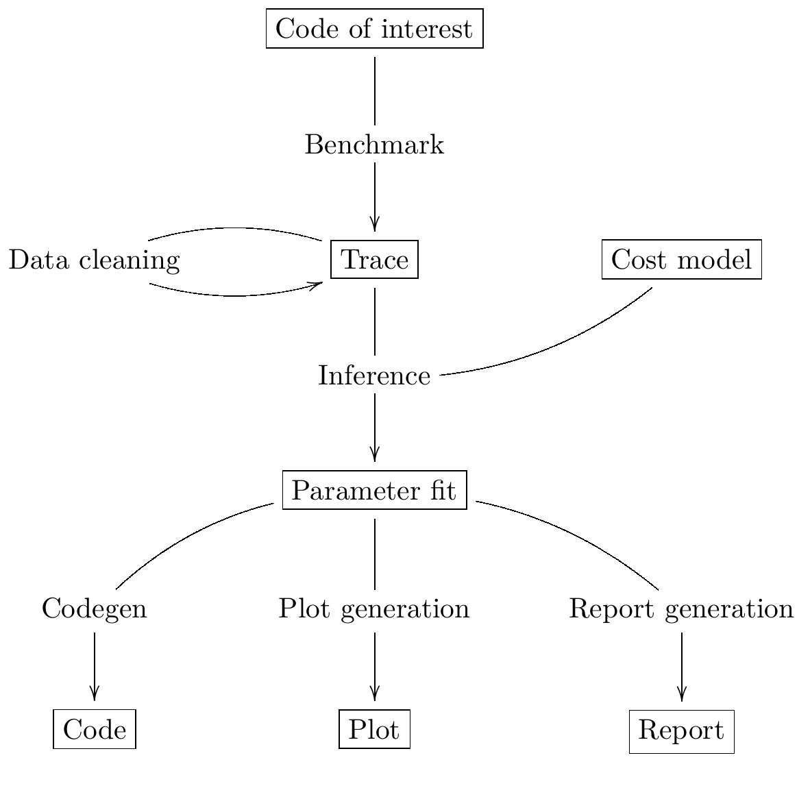

Architecture of ``octez-snoop``
===============================

The following figure describes the main functionalities and data
processed by ``octez-snoop``, to be read from top to bottom. The boxed
nodes represents the various kinds of data processed by the tool,
while the unboxed items represent computational steps.

The code architecture of ``octez-snoop`` is itself divided in the following
main packages:

- ``bin_snoop`` is the main binary (you can have a look at the :ref:`manual<benchmark_tool_manual>`).
- ``tezos-benchmark`` is a library for performing measurements, writing models
  and infering parameters for these models.
- ``tezos-micheline-rewriting`` is used to perform rewriting of Micheline terms
  (documentation available :doc:`here <tezos_micheline_rewriting>`).
  It is mainly used when writing protocol-specific benchmarks but is independent
  from the protocol.

There are other packages containing shell-specific and protocol-specific benchmarks,
these are not documented here.

Here, we will focus on the ``tezos-benchmark`` library, which is the core of the
tool.

High-level description
----------------------

``octez-snoop`` is a tool for benchmarking and fitting statistical models which predict the performance of any piece of code of interest.

More concretely, let us consider a piece of code for which we wish to predict its performance. To understand the performance profile of this piece of code, we must execute it with different arguments, varying the size of the problem to be solved. As "the size of the problem to be solved" is a long expression, we will use the shorter term *workload* for that.

The notion of workload is abstract here, and indeed, it is not necessarily a scalar. Here are a few examples of workloads:

- Timer benchmarks measure the latency of the timer itself and the associated workloads record nothing.
- IO benchmarks measure the execution time of performing specific read and write patterns to the underlying key-value store and the associated workloads record the size of the storage as well as the parameters (bytes read/written, length of keys, etc) of these accesses.
- Translator benchmarks measure the execution time of various pieces of ``Script_ir_translator`` (the *translator* for short, which handles typechecking/unparsing of code and data) as well as Micheline serialization, and corresponding workloads record the size of the typechecked/unparsed/(de)serialized terms.
- Michelson benchmarks measure the execution time of the interpreter on specific programs and the associated workloads record the list of all executed instructions together with, for each instruction, the sizes of the operands as encountered on the stack.

Once this notion of workload is clear, we can describe Snoop's user interface.

Using ``tezos-benchmark`` requires to provide, for each benchmark, the following main items:

- a type of execution ``workload``;
- a statistical model, corresponding to a function which to each ``workload`` associates an expression (possibly with free variables) denoting the predicted execution time for that workload. In simple cases, the model consists in *a single* expression computing a predicted execution time for any given workload.
- A family of pieces of code (i.e. closures) to be benchmarked, each associated to its ``workload``. Thus, each closure contains the application of a piece of a code to arguments instantiating a specific workload. We assume that the execution time of each closure has a well-defined distribution. In most cases, these closures correspond to executing *a single* piece of code of interest with different inputs.

From this input, ``tezos-benchmark`` can perform for you the following tasks:

- perform the timing measurements;
- infer the free parameters of the statistical model;
- display the results of benchmarking and inference;
- generate code from the model.

Code organization
-----------------

The data type that wraps everything up is the module type ``Benchmark.S``.
The main items required by this type are:

- ``create_benchmarks``, a function that must generate closures and their associated workloads (packed together in type ``'workload Generator.benchmark``).
- ``models``, a list of statistical models that we'd like to fit to predict the execution time of the piece of code of interest.

The library is meant to be used as follows:

- define a ``Benchmark.S``, which requires

  - constructing benchmarks
  - defining models, either pre-built (via the ``Model`` module) or from scratch (using the ``Costlang`` DSL);

- generate empirical timing measurements using ``Measure.perform_benchmark``;
- given the data generated, infer parameters of the models
  using ``Inference.make_problem`` and ``Inference.solve_problem``;
- exploit the results:

  - input back the result of inference in the model to make it predictive
  - plot the data (``tezos-benchmark`` can generate CSV)
  - generate code from the model (``Codegen`` module)

Modules implementing the ``Benchmark.S`` signature can also be registered
via the ``Registration.register`` function which makes them available to
``octez-snoop``, a binary that wraps these features under a nice CLI.

Defining benchmarks: the ``Generator`` module
---------------------------------------------

The ``Generator.benchmark`` type defines the interface that each benchmark
must implement. At the time of writing, this type specifies three ways
to provide a benchmark (but more could easily be added):

.. code-block:: ocaml

   type 'workload benchmark =
     | Plain : {workload : 'workload; closure : unit -> unit} -> 'workload benchmark
     | With_context : {
         workload : 'workload;
         closure : 'context -> unit;
         with_context : 'a. ('context -> 'a) -> 'a;
       } -> 'workload benchmark
     | With_probe : {
         workload : 'aspect -> 'workload;
         probe : 'aspect probe;
         closure : 'aspect probe -> unit;
       }
         -> 'workload benchmark

Plain benchmarks
~~~~~~~~~~~~~~~~

The ``Plain`` constructor simply packs a workload and a closure together.
The implied semantics of this benchmark is that the ``closure`` is
a stateless piece of code, ready to be executed thousands of times
by the measure infrastructure.

With_context benchmarks
~~~~~~~~~~~~~~~~~~~~~~~

The ``With_context`` constructor allows to define benchmarks we
require to set up and cleanup a *context*, shared by all executions of
the closure. An example (which prompted the addition of this feature)
is the case of storage benchmarks, where we need to create a directory
and set up some files before executing a closure containing e.g.
a read or write access, after which the directory must be removed.

With_probe benchmarks
~~~~~~~~~~~~~~~~~~~~~

The ``With_probe`` constructor allows fine-grained benchmarking by
inverting control: the user is in charge of calling the pieces of code
to be benchmarked using the provided ``probe``. The definition of a
probe consists in a small object with three methods:

.. code-block:: ocaml

   type 'aspect probe = {
     apply : 'a. 'aspect -> (unit -> 'a) -> 'a;
     aspects : unit -> 'aspect list;
     get : 'aspect -> float list;
   }

The intended semantics of each method is as follows:

- calling ``probe.apply aspect f`` executes ``f``, performing e.g. a
  timing measurement of ``f``'s execution time and returns the result
  of the evaluation. The measurement is associated to the specified
  ``aspect`` in a side-effecting way.
- ``probe.aspects`` returns the list of all aspects.
- Finally, ``probe.get aspect`` returns all the measurements associated
  to ``aspect``.

Note that ``With_probe`` benchmarks do not come with a fixed workload,
but rather with an aspect-indexed family of workloads. This reflects
the fact that this kind of benchmark can measure
several different pieces of code in the same run,
each potentially associated to its own cost model.

The function ``Measure.make_timing_probe`` provides a basic probe
implementation. The unit test in ``src/lib_benchmark/test/test_probe.ml``
contains an example.

Defining a predictive model: the ``Model`` module
-------------------------------------------------

As written above, the ``Benchmark.S`` signature also requires a list
of *models* (note that users only interested in measures of execution
time can leave this list empty). At the time of writing, ``tezos-benchmark``
only handles *linear models*.

.. _Linear models primer:

Linear models: a primer
~~~~~~~~~~~~~~~~~~~~~~~

We aim at predicting the cost (typically, execution time) for various parts of
the codebase. To do this, we must first come up with a *model*.
These cost models take as input some notion of "size" (typically a vector
of integers) and output a prediction of execution time (or, up to unit
conversion, a quantity of gas). If :math:`S` is the abstract set of sizes,
we're trying to infer a function of type :math:`S \rightarrow \mathbb{R}_{\ge 0}`
from a finite list of examples :math:`(s_n, t_n)_n \in (S \times \mathbb{R}_{\ge 0})^\ast`
which minimizes some error criterion. This is an example of a **regression**
problem.

Note that since :math:`S` is typically not finite, :math:`S \rightarrow \mathbb{R}_{\ge 0}`
is an infinite-dimensional vector space. We will restrict our search
to a :math:`n`-dimensional subset of functions :math:`f_\theta`, with :math:`\theta \in \mathbb{R}^n`,
of the form

.. math::

  f_\theta = \sum_{i=1}^n \theta_i g_i

where the :math:`(g_i)_{i=1}^n` is a **fixed** family of
functions :math:`g_i : S \rightarrow \mathbb{R}_{\ge 0}`.
An :math:`n`-dimensional linear cost model is entirely determined by the :math:`g_i`.

Enumerating the currying isomorphisms, a linear model can be considered as:

1. a **linear** function :math:`\mathbb{R}^n \multimap (S \rightarrow \mathbb{R}_{\ge 0})`
   from "meta" parameters to cost functions;
2. a function :math:`S \rightarrow (\mathbb{R}^n \rightarrow \mathbb{R}_{\ge 0})`
   from sizes to linear forms over "meta" parameters;
3. a function :math:`S \times \mathbb{R}^n \rightarrow \mathbb{R}_{\ge 0}`.

The two first forms are the useful ones. The first form is useful in stating
the inference problem: we seek :math:`\theta` that minimizes some empirical
error measure over the benchmark results. The second form is useful as it
allows to transform the linear model in vector form, when applying the
size.

.. _Costlang DSL:

The ``Costlang`` DSL
~~~~~~~~~~~~~~~~~~~~

The module ``Costlang`` defines a small language in which to define terms
having both free and bound variables. The intended semantics for free
variables is to stand in for variables to be inferred during the inference
process (corresponding to :math:`\theta_i` in the previous section).
The language is defined in tagless final style. If this does not
ring a bell, we **strongly** recommend you take a look at
https://okmij.org/ftp/tagless-final/index.html in order to make sense of the
rest of this section. The syntax is specified by the ``Costlang.S`` module
type:

.. code-block:: ocaml

   module type S = sig
     type 'a repr
     type size
     val true_ : bool repr
     val false_ : bool repr
     val int : int -> size repr
     val float : float -> size repr
     val ( + ) : size repr -> size repr -> size repr
     val ( - ) : size repr -> size repr -> size repr
     val ( * ) : size repr -> size repr -> size repr
     val ( / ) : size repr -> size repr -> size repr
     val max : size repr -> size repr -> size repr
     val min : size repr -> size repr -> size repr
     val log2 : size repr -> size repr
     val free : name:Free_variable.t -> size repr
     val lt : size repr -> size repr -> bool repr
     val eq : size repr -> size repr -> bool repr
     val shift_left : size repr -> int -> size repr
     val shift_right : size repr -> int -> size repr
     val lam : name:string -> ('a repr -> 'b repr) -> ('a -> 'b) repr
     val app : ('a -> 'b) repr -> 'a repr -> 'b repr
     val let_ : name:string -> 'a repr -> ('a repr -> 'b repr) -> 'b repr
     val if_ : bool repr -> 'a repr -> 'a repr -> 'a repr
   end

In a nutshell, the type of terms is ``type 'a term = \pi (X : S). 'a X.repr``,
i.e. terms must be thought of as parametric in their implementation,
provided by a module of type ``S``.

It must be noted that this language does not enforce that built
terms are linear (in the usual, not type-theoretic sense) in their
free variables: this invariant must be currently enforced dynamically.
The ``Costlang`` module defines some useful functions for manipulating
terms and printing terms:

- ``Costlang.Pp_impl`` is a simple pretty printer,
- ``Costang.Eval_impl`` is an evaluator (which fails on terms
  having free variables),
- ``Costlang.Eval_linear_combination_impl`` evaluates terms
  which are linear combinations in their free variables to
  vectors (corresponding to applying a size parameter to the second
  curried form in the previous section),
- ``Costlang.Subst`` allows to perform substitution of free variables,
- ``Costlang.Hash_cons`` allows to manipulate hash-consed terms,
- ``Costlang.Beta_normalize`` allows to beta-normalize...

Other implementations are provided elsewhere, e.g. for code or
report generation.

Definition of cost models: the ``Model`` module
~~~~~~~~~~~~~~~~~~~~~~~~~~~~~~~~~~~~~~~~~~~~~~~

The ``Model`` module provides a higher-level interface over ``Costlang``,
and pre-defines widely used models. These pre-defined models are independent
of any specific workload: they need to be packaged together with a conversion
function from the workload of the benchmark of interest to the domain
of the model. The ``Model.make ~conv ~model`` function does just this.

.. _Measure module:

The ``Measure`` module
----------------------

The ``Measure`` module is dedicated to measuring the execution
time of closures held in ``Generator.benchmark`` values and
turn these into timed workloads (i.e. pairs of workload and execution time).
It also contains routines to remove outliers and to save and load
workload data together with extra metadata.

Measuring execution time of ``Generator.benchmark`` values
~~~~~~~~~~~~~~~~~~~~~~~~~~~~~~~~~~~~~~~~~~~~~~~~~~~~~~~~~~

The core of the functionality is provided by the ``Measure.perform_benchmark``
function.

.. code-block:: ocaml

   val perform_benchmark :
     Measure.options -> ('c, 't) Tezos_benchmark.Benchmark.poly -> 't workload_data

Before delving into its implementation, let's examine its type.
A value of type ``('c, 't) Tezos_benchmark.Benchmark.poly`` is a first
class module where ``'c`` is a type variable corresponding to the configuration
of the benchmark and ``'t`` is a variable corresponding to the type
of workloads of the benchmark. Hence ``perform_benchmark`` is parametric
in these types.

Under the hood, this functions calls to the ``create_benchmarks``
function provided by the first class module to create a list of
``Generator.benchmark`` values. This might involve loading from
benchmark-specific parameters from a JSON file if the benchmark
so requires. After setting up some benchmark parameters
(random seed, GC parameters, CPU affinity), the function iterates over the
list of ``Generator.benchmark`` and calls
``Measure.compute_empirical_timing_distribution`` on the closure contained
in the ``Generator.benchmark`` value.  This yields an
empirical distribution of timings which must be determinized: the user
can pick either a percentile or the mean of this distribution. The
function then records the execution time together with the workload
(contained in the ``Generator.benchmark``) in its list of results.

Loading and saving benchmark results
~~~~~~~~~~~~~~~~~~~~~~~~~~~~~~~~~~~~

The ``Measure`` module provides functions ``save`` and ``load`` for
benchmark results. Concretely, this is implemented by providing
an encoding for the type ``Measure.measurement`` which corresponds to
a ``workload_data`` together with some meta-data (CLI options used, benchmark
name, benchmark date).

Removing outliers from benchmark data
~~~~~~~~~~~~~~~~~~~~~~~~~~~~~~~~~~~~~

It can happen that some timing measurement is polluted by e.g. another
process running in the same machine, or an unlucky scheduling. In this
case, it is legitimate to remove the tainted data point from the data
set in order to make fitting cost models easier. The function
``Measure.cull_outliers`` is dedicated to that:

.. code-block:: ocaml

   val cull_outliers : nsigmas:float -> 'workload workload_data -> 'workload workload_data

As its signature suggests, this function removes the workloads whose
associated execution time is below or above ``nsigmas`` standard deviations
of the mean. **NB** make a considerate use of this function, do not
remove data just because it doesn't fit your model.

Computing parameter fits: the ``Inference`` module
--------------------------------------------------

The inference subsystem takes as input benchmark results and statistical models
and fits the models to the benchmark results. Abstractly, the benchmark results
consist of a list of pairs  ``(input, outputs)`` for an unknown function
while the statistical model corresponds to a parameterised family of functions.
The goal of the inference subsystem is to find the parameter corresponding
to the function that best fits the relation between inputs and outputs.

In our case, the ``inputs`` correspond to workloads and the ``outputs`` to execution
times, as described in some length in previous sections.

The goal of the ``Inference`` module is to solve the regression problem
described in the :ref:`primer on linear models <Linear models primer>`.
As inputs, it takes a cost model and some empirical data under the form
of a list of workloads as produced by the ``Measure`` module (see the related
:ref:`section<Measure module>`). Informally, the inference process can be
decomposed in the two following steps:

- transform the cost model and the empirical data into a
  matrix equation :math:`A x = T` where the input dimensions of :math:`A`
  (i.e. the columns) are indexed by free variables (corresponding to
  cost coefficients to be inferred), the output dimensions
  of :math:`A` are indexed by workloads and where :math:`T` is the column
  vector containing execution times for each workload;
- solve this problem using an off-the-shelf optimization package, yielding
  the solution vector :math:`x` assigning execution times to the free
  variables.

Before looking at the code of the ``Inference`` module, we consider
for illustrative purposes a simpler case study.

.. _Inference case study:

Case study: constructing the matrices
~~~~~~~~~~~~~~~~~~~~~~~~~~~~~~~~~~~~~

We'd like to model the execution time of an hypothetical piece of code
sorting an array using merge sort. We *know* that the time complexity of merge sort
is :math:`O(n \log{n})` where :math:`n` is the size of the array: we're
interested in predicting the actual execution time as a function of
:math:`n` for practical values of :math:`n`.

We pick the following cost model:

.. math::

   \text{cost}(n) = \theta_0 + \theta_1 \times n \log{n}

Our goal is to determine the parameters :math:`\theta_0`
and :math:`\theta_1`. Using the :ref:`Costlang DSL<Costlang DSL>`,
this model can be written as follows:

.. code-block:: ocaml

   module Cost_term = functor (X : Costlang.S) ->
   struct
     open X
     let cost_term =
       lam ~name:"n"
       @@ fun n ->
       free ~name:"theta0" + (free ~name:"theta1" * n * log2 n)
   end

Assuming we performed a set of benchmarks, we have a set of
timing measurements corresponding to pairs :math:`(n_i, t_i)_i`
where :math:`n_i` and :math:`t_i` correspond respectively to
the size of the array and the measured sorting time for the
:math:`i` th benchmark.

By evaluating the model :math:`cost` on each :math:`n_i`, we get a
family of linear combinations :math:`\theta_0 + \theta_1 \times n_i \log{n_i}`.
Each such linear combination is isomorphic to the vector
:math:`(1, n_i \log{n_i})`. These vectors correspond to the row vectors of
the matrix :math:`A` and the durations :math:`t_i` form the components of
the column vector :math:`T`.

In terms of code, this corresponds to applying :math:`n_i` to ``cost_term``
and beta-reducing. The ``Inference`` module defines a hash-consing partial
evaluator ``Eval_to_vector``:

.. code-block:: ocaml

   module Eval_to_vector = Beta_normalize (Hash_cons (Eval_linear_combination_impl))

All these operations (implemented in tagless final style) are defined in the
``Costlang`` module. ``Beta_normalize`` beta-normalizes terms, ``Hash_cons``
shares identical subterms and ``Eval_linear_combination_impl`` transforms an
evaluated term of the form
``free ~name:"theta0" + (free ~name:"theta1" * n_i * log2 n_i)`` into a vector
mapping ``"theta0"`` to ``1`` and ``theta1`` to ``n_i * log2 n_i``.

Applying ``cost_term`` to a constant ``n_i`` in tagless final form
corresponds to the following term:

.. code-block:: ocaml

   module Applied_cost_term = functor (X : Costlang.S) ->
   struct
     let result = X.app Cost_term(X).cost_term (X.int n_i)
   end

and performing the partial evaluation is done by applying
``Eval_to_vector``:

.. code-block:: ocaml

   module Evaluated_cost_term = Applied_cost_term (Eval_to_vector)

The value ``Evaluated_cost_term.result`` corresponds to the row vector
:math:`i` of the matrix :math:`A`.

Structure of the inference module
~~~~~~~~~~~~~~~~~~~~~~~~~~~~~~~~~

We now describe in details the two main functionalities of the ``Inference`` module:

- making regression problems given a cost model and workload data;
- solving regression problems.

Making regression problems
++++++++++++++++++++++++++

As explained in the :ref:`previous section<Inference case study>`, a regression
problem corresponds to a pair of matrices :math:`A` and :math:`T`. This information
is packed in the ``Inference.problem`` type.

.. code-block:: ocaml

   type problem =
     | Non_degenerate of {
         lines : constrnt list;
         input : Scikit.Matrix.t;
         output : Scikit.Matrix.t;
         nmap : NMap.t;
       }
     | Degenerate of {predicted : Scikit.Matrix.t; measured : Scikit.Matrix.t}

Let's look at the non-degenerate case.
The ``input`` field  corresponds to the ``A`` matrix while  the ``output`` field
corresponds to the ``T`` matrix. The ``nmap`` field is a bijective mapping
between the dimensions of the matrices and the variables of the original
problem. The ``lines`` field is an intermediate representation of the
problem, each value of type ``constrnt`` corresponding to a linear equation
in the variables:

.. code-block:: ocaml

   type constrnt = Full of (Costlang.affine * quantity)

The function ``make_problem`` converts a model and workload data (as obtained from
the :ref:`Measure module<Measure module>`) into an ``Inference.problem``.
Let's look at the signature of this function:

.. code-block:: ocaml

   val make_problem :
     data:'workload Measure.workload_data ->
     model:'workload Model.t ->
     overrides:(string -> float option) ->
     problem

The ``data`` and ``model`` arguments are self-explanatory. The ``overrides``
argument allows to manually set the value of a variable of the ``model`` to some
fixed value. This is especially useful when the value of a variable can be
determined from a separate set of experiments. The prototypical example is
how the timer latency is set (see the :ref:`snoop usage example<Fitting the model>`).

The job performed by ``make_problem`` essentially involves applying the cost model
to the workloads, as described in the previous section.

Solving the matrix equation
+++++++++++++++++++++++++++

Once we have a ``problem`` at hand, we can solve it using
the ``solve_problem`` function:

.. code-block:: ocaml

   val solve_problem : problem -> solver -> solution

Here, ``solver`` describes the available optimization algorithms:

.. code-block:: ocaml

   type solver =
     | Ridge of {alpha : float; normalize : bool}
     | Lasso of {alpha : float; normalize : bool; positive : bool}
     | NNLS

The ``Lasso`` algorithm works well in practice. Setting the positivity
constraint to ``true`` forces the variables to lie in the positive reals.
At the time of writing, these are implemented as calls to the Python ``Scikit-learn``
library. The ``solution`` type is defined as follows:

.. code-block:: ocaml

   type solution = {
     mapping : (Free_variable.t * float) list;
     weights : Scikit.Matrix.t;
   }

The ``weights`` field correspond to the raw solution vector to the matrix
problem outlined earlier. The ``mapping`` associates the original variables
to their fit.

Parameter inference for sets of benchmarks
~~~~~~~~~~~~~~~~~~~~~~~~~~~~~~~~~~~~~~~~~~

As hinted before, benchmarks are not independent from one another:
one sometimes needs to perform a benchmark for a given piece of code,
estimate the cost of this piece of code using the inference module
and then inject the result into another inference problem. For short
chains of dependencies this is doable by hand, however when dealing with
e.g. more than one hundred Michelson instructions it nice to have an
automated tool figuring out the dependencies and scheduling the inference
automatically.

``octez-snoop`` features this. The ``infer parameters`` command is launched
in "full auto" mode when a *directory* is passed to it instead of a simple
workload file. The tool then automatically scans this directory for all
workload files, compute a dependency graph from the free variables and performs
a topological run over this dependency graph, computing at each step
the parameter fit and injecting the results in the subsequent inference
problems. The dependency graph computation can be found in the ``Dep_graph``
module of ``bin_snoop``.
