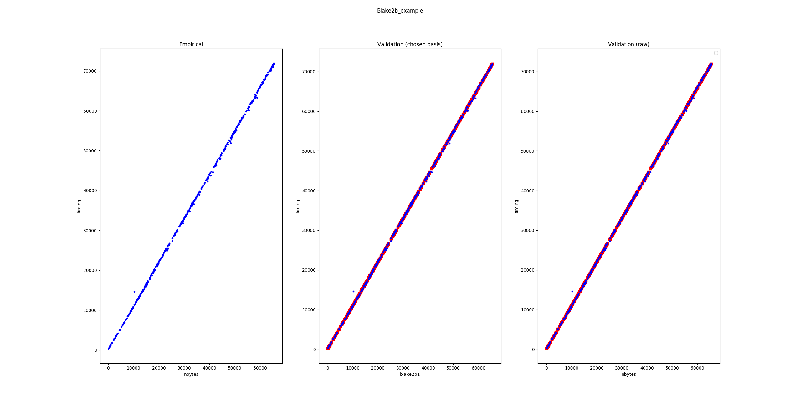

In-depth usage example: more control over your benchmark
========================================================

This section borrows the example from the :doc:`Snoop tutorial <snoop_tutorial>`
on the ``blake2b`` hashing function, but relies on Snoop sub-commands for better
control over the benchmark process (corresponding to Step 2 in the tutorial).
The objectives and the output files are the same as in the tutorial:
benchmarking, inferring gas parameter values and generating the corresponding
OCaml code, but sub-commands help to understand each sub-step, especially in
case of unexpected results.

Step 1: Checking the timer
--------------------------

Before we perform the benchmarks, we need to ensure that the system timer
is sufficiently precise. This data is also useful to subtract the latency
of the timer for benchmarks of very small duration (which is not required here).
We invoke the tool on the built-in benchmark ``TIMER_LATENCY`` and specify
(through ``--bench-num``) that we want only one closure to benchmark (since all closures are identical
for this benchmark) but to execute this closure ``100000`` times (through ``--nsamples``).

.. code-block:: shell

   octez-snoop benchmark TIMER_LATENCY and save to timer.workload --bench-num 1 --nsamples 100000

The tool returns the following on standard output:

::

   Benchmarking with the following options:
   { options = { flush_cache=false;
                 stabilize_gc=false;
                 seed=self-init;
                 bench #=1;
                 nsamples/bench=100000;
                 determinizer=percentile 50;
                 cpu_affinity=none;
                 minor_heap_size=262144 words;
                 config directory=None };
      save_file = timer.workload;
      storage = Mem }
   Using default configuration for benchmark TIMER_LATENCY
   {}
   benchmarking 1/1
   stats over all benchmarks: { max_time = 25.000000 ; min_time = 25.000000 ; mean_time = 25.000000 ; sigma = 0.000000 }

This commands measures ``100000`` times the latency of the timer, that is
the minimum time between two timing measurements. This yields an empirical distribution
on timings. The tool takes the 50th percentile (i.e. the median) of the empirical distribution
and returns the result: 25ns latency. This is reasonable.
Since there's only one benchmark (with many samples), the standard deviation is by definition
zero. One could also run many benchmarks with fewer samples per benchmark:

.. code-block:: shell

   octez-snoop benchmark TIMER_LATENCY and save to timer.workload --bench-num 1000 --nsamples 100

This yields on standard output:

::

   Benchmarking with the following options:
   { options = { flush_cache=false;
                 stabilize_gc=false;
                 seed=self-init;
                 bench #=1000;
                 nsamples/bench=100;
                 determinizer=percentile 50;
                 cpu_affinity=none;
                 minor_heap_size=262144 words;
                 config directory=None };
      save_file = timer.workload;
      storage = Mem }
   Using default configuration for benchmark TIMER_LATENCY
   {}
   benchmarking 1000/1000
   stats over all benchmarks: { max_time = 40.000000 ; min_time = 23.000000 ; mean_time = 24.130000 ; sigma = 0.653529 }

This is consistent with the previous results.

A reliable timer should have a latency of the order of 20 to 30 nanoseconds, with a very small standard deviation.
It can happen on some hardware or software configurations that the timer latency is of the order of
*microseconds* or worse: this makes benchmarking short-lived computations impossible.

Step 2: Benchmarking
--------------------

If the results obtained in the previous section are reasonable,
we can proceed to the generation of raw timing data. We want
to invoke the ``Blake2b_example`` benchmark and save the resulting data to ``./blake2b.workload``.
We want ``500`` distinct random inputs, and for each input we will perform
the timing measurement ``3000`` times. The ``--determinizer`` option specifies
how the empirical timing distribution corresponding to the per-input ``3000`` samples
will be converted to a fixed value: here we pick the 50th percentile, i.e. the median
(which happens to also be the default, so this option could have been omitted).
We also use an explicit random seed in case we want to reproduce the exact same benchmarks.
If not specified, the PRNG will self-initialize using an unknown seed.

.. code-block:: shell

   octez-snoop benchmark Blake2b_example and save to blake2b.workload --bench-num 500 --nsamples 3000 --determinizer percentile@50 --seed 12897

Here's the output:

::

   Benchmarking with the following options:
   { options = { flush_cache=false;
                 stabilize_gc=false;
                 seed=12897;
                 bench #=500;
                 nsamples/bench=3000;
                 determinizer=percentile 50;
                 cpu_affinity=none;
                 minor_heap_size=262144 words;
                 config directory=None };
      save_file = blake2b.workload;
      storage = Mem }
   Using default configuration for benchmark Blake2b_example
   { "max_bytes": 65536 }
   benchmarking 500/500
   stats over all benchmarks: { max_time = 71957.000000 ; min_time = 284.000000 ; mean_time = 34750.532000 ; sigma = 20155.604394 }

Since the size of inputs varies a lot, the statistics over all benchmarks are less useful.

Step 2.5: (optional) Removing outliers
--------------------------------------

It is possible to remove outliers from the raw benchmark data. The command is the following:

.. code-block:: shell

   octez-snoop remove outliers from data ./blake2b.workload above 3 sigmas and save to blake2b-cleaned.workload

In this particular example, the data seems clean though:

::

   Measure.load: loaded ./blake2b.workload
   Removing outliers.
   Stats: { max_time = 71925.000000 ; min_time = 289.000000 ; mean_time = 34988.436000 ; sigma = 20766.341788 }
   Validity interval: [-27310.589365, 97287.461365].
   Removed 0 outliers out of 500 elements.

The best defense against outliers is to have clean data in the first place: use a stable environment for benchmarking.

.. _Fitting the model:

Step 3: Fitting the model
-------------------------

We can now proceed to inferring the free parameters from the model using the data.
At the time of writing, the tool offloads the regression problem to the `scikit-learn <https://scikit-learn.org/>`_
(aka sklearn) and the `statmodels <https://www.statsmodels.org/stable/index.html>`_ Python libraries: install them before proceeding.

.. code-block:: shell

   pip install scikit-learn statsmodels

Let's execute the following command:

.. code-block:: shell

   octez-snoop infer parameters for model blake2b on data blake2b.workload using lasso --lasso-positive --dump-csv blake2b.csv --save-solution blake2b.sol --plot

::

   Initializing python... Done.
   Measure.load: loaded blake2b.workload
   Applying model to workload data 500/500
   Initializing matrices 500/500
   Importing blake2b.csv
   Exporting to blake2b.csv
   Saved solution to blake2b.sol

The command performed the following tasks:

- load the workload data from ``blake2b.workload``;
- construct a linear regression problem using the chosen model: here,
  the ``Blake2b_example`` benchmark only provides the ``blake2b`` model;
- solve this problem using the specified ``lasso`` algorithm, with the
  constraint that the inferred coefficients must be positive;
- dump the result of inference to a csv file named ``blake2b.csv``;
- save a structured solution (useful for code generation) to ``blake2b.sol``;
- plot the result of inference.

Let's first have a look at the contents of the CSV solution ``blake2b.csv``.

.. csv-table:: Inference results
   :header: "blake2b_const", "blake2b_ns_p_byte"

   129.279086813,1.09627036127

The columns correspond to the inferred values for the free
variables of the ``blake2b`` cost model. The units are respectively
ns/bytes for ``blake2b_ns_p_byte`` and ns for ``blake2b_const``.

The tool also produces a plot:

The leftmost figure plots the empirical data, i.e. the raw execution time
(in nanoseconds) as a function of the input size (here, in bytes -- other
data structures might use different notions of sizes). The rightmost figure
plots the empirical data along the predicted execution time. If the model
is good and the parameters were correctly fitted, these should match.
The central plot is useful when using complex nonlinearities to model
the execution time of some piece of code: the tool will project back the
raw data in the linear space spanned by the chosen nonlinearities and
if the model is good, one should observe that the empirical data lies
along a linear subspace. Here, the model is trivial so the central plot
is less interesting.

Step 4: Generating code
-----------------------

As a final step, we demonstrate how to generate code corresponding to the
model. This is typically used to generate gas consumption functions
for Michelson instructions and not for raw functions like ``blake2b``
but the principle is similar.

.. code-block:: shell

   octez-snoop generate code using solution blake2b.sol and model blake2b_codegen

By default, the tool produces integer code by casting floating point constant to integers.
The tool produces the following code on ``stdout``:

.. code-block:: ocaml

   let model_blake2b_codegen size =
       (int_of_float 144.753899773) + (int_of_float 1.17988921492) * size

It is also possible to generate code implementing the cost function using
fixed-point arithmetic. This requires specifying some codegen parameters in a JSON
file. For instance, we can require to consider 5 bits of precision and use
rounding to nearest to convert constants, failing if we make more than 10% relative
error when casting. The ``inverse_scaling`` and ``resolution`` parameters respectively
specify the fraction of digits considered to be not significant, and the resolution
of the grid used when prettifying constants (in nanoseconds).

.. code-block:: JSON

   { "precision": 5, "max_relative_error": 0.1, "cast_mode": "Round", "inverse_scaling": 3, "resolution": 5 }

Calling the tool:

.. code-block:: shell

   octez-snoop generate code using solution blake2b.sol and model blake2b_codegen --fixed-point codegen_params.json

We get:

.. code-block:: ocaml

   let model_blake2b_codegen size =
       let v0 = size in
       150 + ((v0 + (v0 lsr 3)) + (v0 lsr 5))
