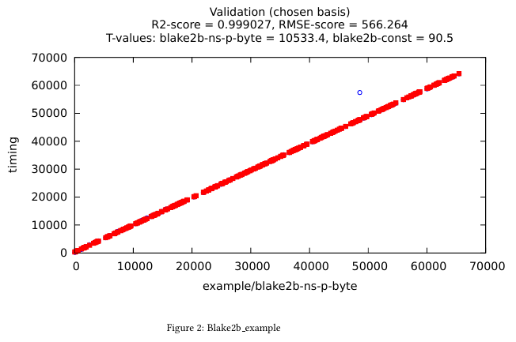

Snoop usage tutorial
====================

We present a typical benchmark workflow using ``octez-snoop``.
We'll consider the case of the ``blake2b`` hashing function, which
is used among other things to hash blocks, operations and contexts:

.. code-block:: ocaml

   Tezos_crypto.Blake2B.hash_bytes : ?key:bytes -> bytes list -> Tezos_crypto.Blake2B.t

At the time of writing, this function is a thin wrapper which
concatenates the list of bytes and passes it to the ``blake2b``
implementation provided by `HACL* <https://github.com/hacl-star/hacl-star>`_.

Step 1: Defining the benchmark
------------------------------

Benchmarks correspond to OCaml modules implementing the ``Benchmark.S`` signature.
These must then be registered via the ``Registration.register`` function.
Of course, for this registration to happen, the file containing the benchmark
and the call to ``Registration.register`` should be linked with ``octez-snoop``.
See :doc:`snoop_arch` for complementary details.

We'll define the benchmark module chunk by chunk and describe each part.
For a starter, names are associated to various entities, and we use namespaces
to help organize them.

.. code-block:: ocaml

   open Tezos_benchmark

   let ns = Namespace.(make root "example")

Benchmarks are referenced by ``name``. The ``info`` field is a brief
description of the benchmark. ``module_filename`` will help users finding where
the benchmark is implemented simply using the command line interface. If we need to generate OCaml code to a
specific location, we can set it with the ``generated_code_destination`` field.
Finally, there's also a system of ``tags`` that allows listing benchmarks by
kind.

.. code-block:: ocaml

   module Blake2b_bench : Benchmark.S = struct
     let name = ns "Blake2b_example"
     let info = "Illustrating tezos-benchmark by benchmarking blake2b"
     let module_filename = __FILE__
     let generated_code_destination = None
     let tags = ["example"]

Typically, a benchmark will depend on a set of parameters for the samplers which
generate input data to the function being benchmarked. These parameters
correspond to the type ``config``. A ``default_config`` is provided, which can
be overridden by specifying a well-formatted JSON file. Reading and writing this
file is made possible by defining a ``config_encoding`` using the
:doc:`data-encoding <data_encoding>` library.

.. code-block:: ocaml

     type config = {max_bytes : int}
     let default_config = {max_bytes = 1 lsl 16}
     let config_encoding =
       let open Data_encoding in
       conv
         (fun {max_bytes} -> max_bytes)
         (fun max_bytes -> {max_bytes})
         (obj1 (req "max_bytes" int31))

Benchmarking involves measuring the execution time of some piece of code and
using the recorded execution time to fit a model. As explained in
:doc:`snoop_arch`, a model is in fact a function of three parameters: a
``workload``, the vector of free parameters to be fitted, and a name for future
reference. The ``workload`` corresponds to the information on the input of the
function being benchmarked required to predict its execution time. Typically, it
corresponds to some notion of "size" of the input. In order to be saved to disk,
we must define a ``workload_encoding`` as well. The ``workload`` type is abstract
seen from the outside of the module, however, for plotting purposes, it is necessary
to exhibit a vector-like structure on these workloads. The ``workload_to_vector``
function maps workloads to sparse vectors. If one is not interested in plotting,
this function can be made to always return ``Sparse_vec.String.zero``.

.. code-block:: ocaml

     type workload = {nbytes : int}
     let workload_encoding =
       let open Data_encoding in
       conv
         (fun {nbytes} -> nbytes)
         (fun nbytes -> {nbytes})
         (obj1 (req "nbytes" int31))
     let workload_to_vector {nbytes} =
       Sparse_vec.String.of_list [("nbytes", float_of_int nbytes)]

We expect the execution time of ``Blake2b.hash_bytes`` to be proportional
to the number of bytes being hashed, with possibly a small constant-time overhead.
Hence, we pick an ``affine`` model. The ``affine`` model is generic, of the form
:math:`\text{affine}(n) = \theta_0 + \theta_1 \times n` with :math:`\theta_i` the free
parameters. One must explain how to convert the ``workload`` to the argument ``n``.
This is the purpose of the ``conv`` parameter.

.. code-block:: ocaml

     let models =
       [ ( "blake2b",
           Model.make
             ~conv:(fun {nbytes} -> (nbytes, ()))
             ~model:
               (Model.affine
                  ~name
                  ~intercept:(Free_variable.of_namespace (ns "blake2b_const"))
                  ~coeff:(Free_variable.of_namespace (ns "blake2b_ns_p_byte"))) ) ]

Finally, we can define the actual benchmark. The function to be defined
is ``create_benchmarks``, which expects to be given an ``rng_state``,
a ``bench_num`` and a ``config`` and returns a list of suspensions, each
suspension yielding a benchmark when evaluated.

One might wonder why this particular signature has been chosen, instead of
returning directly a list of benchmarks, or simply requiring a benchmark
generator to be defined. The reasons for this are:

- the current signature allows for setup code to be shared by all benchmarks
  being generated (not the case here);
- returning a list of suspensions allows to delay the sampling process
  and the memory allocation associated to benchmark generation until
  actually needed, hence preventing memory leaks.

The auxiliary function ``blake2b_benchmark`` is in charge of
preparing a ``closure``, corresponding to a call to ``Blake2b.hash_bytes``
applied to a random ``bytes``, and the associated ``workload``, containing the
size of the random ``bytes``. We want benchmarks to be easily replayable
given a seed, hence the closure-generation function is parameterized with
an explicit ``rng_state`` of type ``Random.State.t``.

.. code-block:: ocaml

     let blake2b_benchmark rng_state config () =
       let nbytes =
         Base_samplers.sample_in_interval
           rng_state
           ~range:{min = 1; max = config.max_bytes}
       in
       let bytes = Base_samplers.uniform_bytes rng_state ~nbytes in
       let workload = {nbytes} in
       (* The closure here is the piece of code to be benchmarked. *)
       let closure () = ignore (Tezos_crypto.Blake2B.hash_bytes [bytes]) in
       Generator.Plain {workload; closure}
     let create_benchmarks ~rng_state ~bench_num config =
       List.repeat bench_num (blake2b_benchmark rng_state config)
   end (* module Blake2b_bench *)

This concludes the definition of the benchmark. Let's register it:

.. code-block:: ocaml

   let () = Registration.register (module Blake2b_bench)

Step 2: Running the benchmark, inferring parameters, and generating code
------------------------------------------------------------------------

Now, we are ready to run our benchmark. All we need is the full name of the
benchmark, which involves namespaces. Fortunately, ``octez-snoop`` enjoys a few
commands to help us if we are not sure what the final name of the benchmark is.

::

   octez-snoop list all benchmarks | grep blake2b

Which prints:

::

   example/Blake2b_example: Illustrating tezos-benchmark by benchmarking blake2b

We can also query more information about the benchmark, resulting from the
registration process.

::

   octez-snoop display info for benchmark example/Blake2b_example

And here is what we get.

::

   Name:
       example/Blake2b_example
   Filename:
       src/lib_benchmark/example/blake2b.ml
   Generated code destination:
       Destination not specified
   Info:
       Illustrating tezos-benchmark by benchmarking blake2b
   Tags:
       example
   Models:
       blake2b:
           Aggregated model containing the following abstract models:
               example/Blake2b_example
               builtin/timer_model

Models and other entities that Snoop manipulates can be displayed, and
:ref:`the Snoop manual <benchmark_tool_manual>` has a dedicated section that we
can explore.

Also, we need to install some Python libraries before going further.

::

   pip install scikit-learn statsmodels

Now we can proceed with our initial goal, and ask Snoop to perform some
measurements and generate OCaml code that reflects the gas cost of running
``blake2b`` depending on its input.

::

   octez-snoop generate code for benchmarks example/Blake2b_example --out-dir /tmp/snoop_results

The tool is quite verbose, but we will not detail what it is telling us here;
this is the purpose of the :doc:`Snoop in-depth example <snoop_example>` section
of the documentation. Two lines are worth noticing though.

::

   Adding solution example/blake2b_ns_p_byte := 0.976187
   Adding solution example/blake2b_const := 295.080202

These are the values that ``octez-snoop`` has inferred for the parameters of the
model we declared, and based on the measurements it performed. The obtained
values are highly dependent on the architecture of the computer and the
processes running in parallel while measuring the execution time.

What Snoop did was to:

- run the benchmark on a certain number of random inputs, and a certain number
  of times for each input;
- infer values for the model parameters so that the model fits as closely as
  possible the measures obtained at the previous step;
- generate an OCaml function representing the model, where rational values are
  approximated using integers manipulation;
- plot the model and the measurements together in a report.

Step 3: checking the generated files
------------------------------------

``octez-snoop`` created several files in ``/tmp/snoop_results`` (the argument of
the ``out-dir`` option). Let's have a look at two of them.

``blake2b.ml`` contains the gas cost function: it estimates the computational
time of running ``blake2b`` on an input of the given size.

::

   (* Do not edit this file manually.
      This file was automatically generated from the models registered at
      src/<protocol>/lib_benchmarks_proto/interpreter_model.ml.
      If you wish to update a function in this file,
      a. update the corresponding model, or
      b. define a new function in michelson_v1_gas_costs.ml, potentially referencing this one. *)

   [@@@warning "-33"]

   module S = Saturation_repr

   (* Inference model name: blake2b *)

   (* model example/Blake2b_example *)
   (* fun size -> (295.080202248 + (0.976187336999 * size)) *)
   let cost_Blake2b_example size =
     let open S.Syntax in
       let size = S.safe_int size in
       let v0 = size in
       (S.safe_int 300) +
         ((((v0 lsr 1) + (v0 lsr 2)) + (v0 lsr 3)) + (v0 lsr 4))

The rational values of the gas parameters have been rounded using integer
arithmetics. The file can be copied and pasted in the protocol, and the cost
function can be called at a specific location so that we can account for gas
when running ``blake2b``.

Another file of interest is ``blake2b.tex`` that we can convert to PDF format.

::

   pdflatex blake2b.tex

The document shows some plots, like this one:

In abscissa, we find the size of inputs randomly chosen during the measurements,
and in ordinate is the computation time.
The blue circles are the values measured by Snoop when running ``blake2b``, and
the red squares are the values obtained for the declared model with the
parameters inferred by Snoop. This allows to evaluate how good the model is:
the more the two overlap, the more precise we are.

Step 4: options
---------------

Some of our benchmarks can take a long time to run. ``octez-snoop`` offers
options to vary the number of random values or the number of times they are
measured, using options ``--nsamples`` and ``--bench-num`` (see
:ref:`the manual <benchmark_tool_manual>`). The default values are 300 random
values and 100 measurements for each. We can specify lower numbers to reduce
benchmark time, but it will also degrade the precision of the results.

Another option of particular interest is ``--plot``. It can be used to
automatically open windows at the end of the whole process. They will show the
same plots as in the report generated at the previous step, but we can interact
with the plots, which is very convenient when they are multi-dimensional (i.e.
when the complexity model relies on more parameters).
