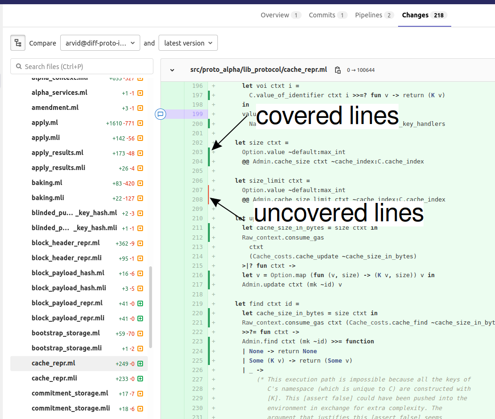

Overview of Testing in Octez
============================

The goal of this document is to give an overview on how testing is done in
Octez, and to help Octez contributors use the test suite and
write tests by pointing them towards the most
appropriate testing framework for their use case. Finally, this guide
explains how tests can be :ref:`run automatically in the Octez CI
<gitlab_test_ci>` and how to :ref:`measure test coverage
<measuring-test-coverage>`.

The frameworks used in Octez can be categorized along two axes: the
type of component they test, and the type of testing they perform. We
distinguish the following components:

 - Node

   - Protocol

     - Michelson interpreter
     - Stitching

 - Networked nodes
 - Client
 - Ledger application
 - Baker

Secondly, these components can be tested at different levels of
granularity. Additionally, tests can verify functionality, but also
non-functional properties such as performance (execution time, memory and disk
usage). We distinguish:

Unit testing
   Unit testing tests software units, typically functions, in isolation.
Integration testing
   Integration testing tests compositions of smaller units.
System testing
   System testing tests the final binaries directly.
Regression testing
   In general, regression testing aims to detect the re-introduction
   of previously identified bugs. It can also refer to a
   coarse-grained type of testing where the output of a test execution
   is compared to a pre-recorded log of expected output. We here use
   "regression testing" to refer to the second meaning.
Property testing / Fuzzing
   Both property testing and fuzzing test
   code with automatically generated inputs. Property testing is
   typically used to ensure functional correctness, and gives the user
   more control over generated input and the expected output. Fuzzing
   is typically used to search for security weaknesses and often guides
   input generation with the goal of increasing test coverage.
Performance testing
   Testing of non-functional aspects such as run-time, memory and disk
   usage.
Acceptance testing
   Testing of the software in real conditions. It is usually slower,
   more costly and less amenable to automation than integration or
   system testing. It is often the final step in the testing process,
   performed before a release. However, in Octez, acceptance testing
   is decoupled from releases, and currently consists in manually running
   a net of resilience tests on a regular base. These tests use various
   testing frameworks.

..
   Inline testing
      Inline testing refers to a fine-grained type of testing, where
      tests are interleaved with the tested code. The inline tests are
      run when the tested code is executed, and typically removed in
      production builds.

By combining the two axes,
we obtain the following matrix. Each cell contains the frameworks
appropriate for the corresponding component and testing type. The frameworks
are linked to a sub-section of this page where the framework is presented
in more detail.

                    ..
                       MT: :ref:`Michelson unit tests <michelson_unit_tests>`.

.. csv-table:: Testing frameworks and their applications in Octez. EXP: :ref:`ppx_expect_section`, AT: :ref:`alcotezt_section`, QC: :ref:`property_based_test`, TZ: :ref:`tezt_section`, LTF: :ref:`long_tezt_section`
   :header: "Component","Unit","Property","Integration","System","Regression","Performance"

   "Node",":ref:`AT <alcotezt_section>`",":ref:`QC <property_based_test>`",":ref:`AT <alcotezt_section>`",":ref:`TZ <tezt_section>`","",":ref:`LTF <long_tezt_section>`"
   "-- Protocol",":ref:`AT <alcotezt_section>`, :ref:`EXP <ppx_expect_section>`",":ref:`QC <property_based_test>`",""
   "-- -- Michelson interpreter",":ref:`AT <alcotezt_section>`","","",":ref:`TZ <tezt_section>`",":ref:`TZ <tezt_section>`"
   "Client",":ref:`EXP <ppx_expect_section>`",":ref:`QC <property_based_test>`","",":ref:`TZ <tezt_section>`","",":ref:`LTF <long_tezt_section>`"
   "Networked nodes","--","",":ref:`TZ <tezt_section>`","", ""
   "Endorser","","","",""
   "Baker","","","",""

Testing frameworks
------------------

.. _ppx_expect_section:

Ppx_expect
~~~~~~~~~~

`Ppx_expect <https://github.com/janestreet/ppx_expect>`_ is a
framework for writing tests for OCaml code generating textual output, similar to
`Cram <https://bitheap.org/cram/>`_ which is used for testing command line applications.

Typical use cases:
 - Unit tests and integration tests leveraging existing printers instead of checking properties.
 - Tests that change on purpose over time. One can easily make tests
   pass again with a single dune invocation ``dune runtest --auto-promote``

Example tests:
 - Unit tests for :src:`src/lib_micheline`, in :src:`src/lib_micheline/test/test_parser.ml`. To
   execute them locally, run ``dune runtest src/lib_micheline/test`` in
   the Octez root.

References:
 - :doc:`Section in Octez Developer Documentation on Ppx_expect <ppx_expect>`
 - `Ppx_expect README <https://github.com/janestreet/ppx_expect>`_.
 - `Dune documentation about inline expectation tests <https://dune.readthedocs.io/en/stable/tests.html#inline-expectation-tests>`_.
 - `Ppx_inline_test README <https://github.com/janestreet/ppx_inline_test>`_.

.. _property_based_test:

QCheck
~~~~~~~

`QCheck <https://github.com/c-cube/qcheck>`_ is a library for
property-based testing in OCaml.

Typical use cases:
 - Verifying input-output invariants for functions with
   randomized inputs.

Example test:
 - QCheck is used in :src:`src/lib_base/test/test_time.ml` to test the `Tezos_base.Time <https://tezos.gitlab.io/api/odoc/_html/tezos-base/Tezos_base/Time/index.html>`_ module. For instance, subtracting and then adding a random amount of seconds to a random time should give back the original time: this tests that ``add`` and ``diff`` are consistent (and the inverse of each other). To run this test, you need to run ``dune exec src/lib_base/test/test_time.exe``.

References:
 - `QCheck README <https://github.com/c-cube/qcheck>`_
 - `QCheck module documentation <https://c-cube.github.io/qcheck/>`_

.. _tezt_section:

Tezt
~~~~

:doc:`Tezt <tezt>` is a system testing framework for Octez. Tezt is capable of regression
testing. Tezt focuses on tests that run in the CI, although it is also
used for some manual tests (see the :src:`tezt/manual_tests`
folder). Its main strengths are summarized in its :doc:`section in the
Tezos Developer Documentation <tezt>`. Conceptually Tezt consists of a
generic framework for writing tests interacting with external
processes, and a set of Octez-specific modules for interacting with
the Octez binaries: the client, baker, etc.

Typical use cases:
 - Testing the commands of ``octez-client``. This allows to test the
   full chain: from client, to node RPC to the implementation of the
   economic protocol.
 - Test networks of nodes, with daemons.
 - Detecting unintended changes in the output of a component, using
   regression tests.

Example tests:
 - Testing baking (in :src:`tezt/tests/basic.ml`)
 - Testing double baking and double endorsement scenarios (in
   :src:`tezt/tests/double_bake.ml`).
 - Testing absence of regressions in encodings (in :src:`tezt/tests/encoding.ml`)

References:
 - :doc:`Section in Tezos Developer Documentation on Tezt <tezt>`
 - `General API documentation <https://nomadic-labs.gitlab.io/tezt/dev/tezt/Tezt/index.html>`__
 - :package-api:`Octez-specific API documentation <tezt-tezos/index.html>`

.. _long_tezt_section:

Long Tests and Performance regression Test Framework
~~~~~~~~~~~~~~~~~~~~~~~~~~~~~~~~~~~~~~~~~~~~~~~~~~~~

A library called `tezt-performance-regression`, which is a wrapper around Tezt, is used for tests that are too long to run in the CI and for performance testing. Those
tests are run on dedicated machines and can send data points to an
`InfluxDB <https://github.com/influxdata/influxdb>`__ instance to produce
graphs using `Grafana <https://github.com/grafana/grafana>`__ and/or
detect performance regressions. See :doc:`long-tezts`.

.. _alcotezt_section:

Alcotezt
~~~~~~~~

Alcotezt is an :ref:`Alcotest <alcotest_section>`-compatible wrapper
for :ref:`Tezt <tezt_section>`. With it, unit tests originally written
for Alcotest (now deprecated) can be executed using Tezt instead. We are currently in
the progress of migrating all Alcotests to Tezt, and we are using
Alcotezt as a stop gap towards this goal. For new unit and integration
testing suites, prefer using Tezt directly.

Typical use cases:
 - Conversion of pre-existing Alcotests to Tezt

Example tests:
 - Unit tests for :package:`tezos-clic`. To execute them locally, run ``dune build @src/lib_clic/runtezt``.
 - Unit tests for :package:`tezos-version`. To execute them locally, run ``dune build @src/lib_version/runtezt``.

See :doc:`alcotezt` for more information on how to convert tests to
Alcotezt, and how to execute them.

.. FIXME tezos/tezos#5090:

   This passage should be removed when the alcotest dependency is
   completely eliminated from the repo.

.. _alcotest_section:

Alcotest (usage deprecated)
~~~~~~~~~~~~~~~~~~~~~~~~~~~

`Alcotest <https://github.com/mirage/alcotest>`_ is a library for unit
and integration testing in OCaml. Alcotest was historically the
primary tool in Octez for unit and integration testing of OCaml code.
However, we are currently migrating to :doc:`Tezt <tezt>` for unit,
integration and system testing. To ease migration from Alcotest to
Tezt, the :ref:`Alcotezt <alcotezt_section>` wrapper was introduced.
Alcotezt is briefly described above and in more detail in
:doc:`alcotezt`. The below Alcotest description applies to tests that
have not yet been converted to Alcotezt.

Typical use cases:
 - Verifying simple input-output specifications for functions with a
   hard-coded set of input-output pairs.
 - OCaml integration tests.

Example tests:
 - Unit tests for :src:`src/lib_requester`, in :src:`src/lib_requester/test/test_requester.ml`. To
   execute them locally, run ``dune build @src/lib_requester/runtest`` in
   the Octez root.
 - Integration tests for the P2P layer in the shell.  For instance
   :src:`src/lib_p2p/test/test_p2p_pool.ml`. This test forks a set of
   processes that exercise large parts of the P2P layer.  To execute
   it locally, run ``dune build @runtest_p2p_pool`` in the Octez
   root.

References:
 - `Alcotest README <https://github.com/mirage/alcotest>`_.

..
   .. _michelson_unit_tests:

   Michelson unit tests
   --------------------

   The `Michelson unit test proposal
   <https://gitlab.com/tezos/tezos/-/merge_requests/1487>`__ defines a
   format for unit tests for Michelson snippets. If the proposal is eventually accepted, then these
   tests will be executable through ``octez-client``.

   Example use cases:
    - Verifying the functional (input--output) behavior of snippets of
      Michelson instructions.
    - Conformance testing for Michelson interpreters.

   References:
    - `Merge request defining the Michelson unit test format <https://gitlab.com/tezos/tezos/-/merge_requests/1487>`_
    - `A conformance test suite for Michelson interpreter using the Michelson unit test format <https://github.com/runtimeverification/michelson-semantics/tree/master/tests/unit>`_

.. _gitlab_test_ci:

Executing tests locally
-----------------------

Whereas executing the tests through the CI, as described below, is the
standard and most convenient way of running the full test suite, they
can also be executed locally.

All tests can be run with ``make test`` in the project root. However, this
can take some time, and some tests are resource-intensive or require additional
configuration. Alternatively, one can run subsets of tests identified
by a specialized target ``test-*``. For instance, ``make test-unit``
runs the alcotest tests and should be quite fast. See the project
``Makefile`` for the full list of testing targets.

.. _measuring-test-coverage:

Measuring test coverage
~~~~~~~~~~~~~~~~~~~~~~~

We measure `test coverage <https://en.wikipedia.org/wiki/Code_coverage>`_
with `bisect_ppx <https://github.com/aantron/bisect_ppx/>`_. This tool
is used to see which lines in the code source are actually executed when
running one or several tests. Importantly, it tells us which parts of the
code aren't tested.

We describe here how ``bisect_ppx`` can be used locally. See below for usage
with CI.

To install ``bisect_ppx``, run the following command from the root of the
project directory:

::

    make build-dev-deps

The OCaml code should be instrumented in order to generate coverage data. This
is done by prepending

::

   ./scripts/with_coverage.sh

to build and test commands run from the root of the project directory. For example,

::

   ./scripts/with_coverage.sh make
   ./scripts/with_coverage.sh make test-coverage

Generate the HTML report from the coverage files using

::

    make coverage-report

The generated report is available in ``_coverage_report/index.html``. It shows
for each file, which lines have been executed at least once, by at least
one of the tests.

Clean up coverage data (output and report) with:

::

    make coverage-clean

The helper ``./scripts/with_coverage.sh`` can also be used outside make commands (e.g. with ``dune``, ``poetry``). For example,

::

   ./scripts/with_coverage.sh dune runtest src/lib_shell/
   ./scripts/with_coverage.sh dune exec tezt/tests/main.exe -f basic.ml

However you launch the tests, the same commands are used to get the report
(e.g. ``make coverage-report``).

Enabling instrumentation for new libraries and executables
""""""""""""""""""""""""""""""""""""""""""""""""""""""""""

To ensure that all libraries and executables are included in the
coverage report, the following field should be added to all ``library``
and ``executable(s)`` stanzas in all ``dune`` files, e.g.:

::

 (library
   (name ...)
   (instrumentation
     (backend bisect_ppx)))

The manifest will add this stanza automatically unless
``~bisect_ppx:false`` is specified.

This enables the conditional instrumentation of the compilation unit
through the ``./scripts/with_coverage.sh`` helper as described above.

Exempted from this rule are the ``dune`` files that belong to tests,
developer utilities and old protocols. In particular:

 - benchmarks, e.g. ``src/lib_shell/bench/dune``
 - bindings, e.g. ``src/lib_sapling/bindings/dune``
 - test frameworks, e.g. ``tezt/lib/dune``
 - test packages, e.g. ``src/*/test/dune``
 - old protocols, e.g. ``src/proto_00*/*/*dune``
 - helper utilities, e.g.:

   - ``src/openapi/dune``, (executable name ``openapi``)
   - ``src/lib_client_base/gen/dune`` (executable name ``bip39_generator``)
   - ``src/lib_protocol_compiler/dune`` (executable name ``replace``)
   - ``src/proto_alpha/lib_parameters/dune`` (executable name ``gen``)
   - ``src/proto_011_PtHangz2/lib_parameters/dune`` (executable name ``gen``)
   - ``src/lib_protocol_environment/ppinclude/dune`` (executable name ``ppinclude``)
   - ``src/lib_store/legacy_store/dune`` (executable name ``legacy_store_builder``)

Truncated coverage files
""""""""""""""""""""""""

Occasionally, tests write corrupted coverage data. If you run into the
issue, you will see a message
like:

::

  $ make coverage-report
  Error: coverage file '_coverage_output/foobar.coverage' is truncated

  make: *** [Makefile:105: coverage-report] Error 1

or

::

  $ make coverage-report
  bisect-ppx-report: internal error, uncaught exception:
                     Bisect_common.Invalid_file("_coverage_output/foobar.coverage", "unexpected end of file while reading magic number")

  make: *** [Makefile:112: coverage-report] Error 125

Typically, this indicates that a instrumented binary that was launched
by the test was terminated abruptly before it had time to finish
writing coverage data. You can just rerun the test, and most likely, it
won't produce a corrupted trace on the second run. However, this is
not a long-term solution. Below, we present some hints on how to debug
this issue:

Binaries instrumented with ``bisect_ppx`` attach an ``at_exit``
handler that writes collected coverage data at termination of the
tested process execution.

To ensure that this process is not disrupted, one should follow these
guidelines:

For system test frameworks
   System test frameworks like :doc:`tezt`,
   run binaries e.g. ``octez-client`` and
   ``octez-node``. Typically, they do so with calls to ``exec`` so the
   resulting process does not inherit the signal handlers from the
   parent process (the test framework). When writing tests in these
   frameworks, the author must ensure that the processes launched are
   instrumented and that they do proper signal handling: they should
   catch ``SIGTERM`` and call exit in their ``SIGTERM`` handler. This
   should already be the case for the binaries in octez.  They should
   also ensure that the framework terminates the processes with ``SIGTERM``.

For integration test frameworks
   Some integration test frameworks, such as the ``lib_p2p`` test
   framework, spawn subprocesses through ``fork``. These
   subprocesses inherit the signal handler of the parent process
   (the test framework). Such frameworks should themselves be
   instrumented and themselves do proper signal handling as described
   above. Bisect provides a convenience for doing so, through the
   ``--sigterm`` flag::

      (preprocess (pps bisect_ppx --bisect-sigterm))

   When enabled, it ensures that the instrumented process writes
   coverage data successfully on receiving ``SIGTERM``. For an
   illustration of how to implement this, and the problem it resolves,
   see :gl:`!3792`.

General process handling
   If possible, do not leave processes "hanging" in tests. Instead,
   use e.g. ``wait`` or ``Lwt.bind`` to ensure that processes get a
   chance to terminate before the full test terminates. For an
   illustration of how to implement this, and the problem it resolves,
   see :gl:`!3691`.

Comparing reports
"""""""""""""""""

At times, it is convenient to compare two coverage reports. This can
be used to ensure that coverage does not regress when e.g. migrating a test
from one framework to another. We provide a `fork of bisect_ppx
<https://github.com/vch9/bisect_ppx/tree/html-compare>`_ with this
functionality. It adds the command ``compare-html`` to ``bisect-ppx-report``.

Running::

  bisect-ppx-report compare-html -x x.coverage -y y.coverage

will create an HTML report comparing the coverage of in ``x.coverage``
and ``y.coverage``. A limitation of this tool is that it assumes that
only coverage has changed -- not the underlying source files.

Executing tests through the GitLab CI
-------------------------------------

All tests are executed on all branches for each commit.  For
instances, to see the latest runs of the CI on the master branch,
visit `this page
<https://gitlab.com/tezos/tezos/-/commits/master>`_. Each commit is
annotated with a green checkmark icon if the CI passed, and a red
cross icon if not. You can click the icon for more details.

The results of the test suite on terminated pipelines is presented on
the details of the merge request page corresponding to the
pipeline's branch (if any). For more information, see the `GitLab
documentation on Unit test reports
<https://docs.gitlab.com/ee/ci/testing/unit_test_reports.html>`__.

By default, the ``test`` of the CI runs the tests as a set of independent jobs
that cluster the tests with a varying grain. This strikes a balance between exploiting GitLab
runner parallelism while limiting the number of jobs per
pipeline. The grain used varies slightly for different types of
tests:

Tezt integration and regression tests
   Tezt tests are grouped in 3 batch jobs. New tests increases the
   size of the last batch.

The OCaml package tests (Alcotest & QCheck)
   The OCaml package tests are regrouped in a set of jobs per protocol package,
   in addition to one job regrouping tests for remaining packages.

Adding tests to the CI
~~~~~~~~~~~~~~~~~~~~~~

When adding a new test that should be run in the CI (which should be
the case for most automatic tests), you need to make sure that it is
properly specified in the :src:`.gitlab-ci.yml` file. The procedure
for doing this depends on the type of test you've added:

Tezt integration and regression tests
  New Tezt tests will be included automatically in the CI.
  To rebalance the Tezt batches, run (from the root of the Octez repository):
  ``make && dune exec tezt/tests/main.exe -- --record tezt/test-results.json``

The OCaml package tests (Alcotest & QCheck)
  Any non-protocol tests located in a folder named ``src/**/test/`` will be
  picked up automatically by the CI. No intervention is necessary.

  Protocol tests must be added to :src:`.gitlab/ci/jobs/test/unit.yml` under the
  protocol that they are testing. For example, to run a new protocol test for
  ``proto_XXX_YYYYYYYY``, add the corresponding
  ``src/proto_XXX_YYYYYYYY/lib_\*.test_proto`` to the ``unit:XXX_YYYYYYYY``
  ``make`` invocation.

Other
  For other types of tests, you need to manually modify the
  :src:`.gitlab-ci.yml`. Please refer to the `GitLab CI Pipeline
  Reference <https://docs.gitlab.com/ee/ci/>`_. A helpful tool for
  this task is the `CI Lint tool <https://docs.gitlab.com/ee/ci/lint.html>`_.

Test coverage in merge requests
~~~~~~~~~~~~~~~~~~~~~~~~~~~~~~~

Build and tests are instrumented with ``bisect_ppx`` in the CI for each merge
request on Octez. To measure test coverage in the CI, it launches the job
``unified_job`` in stage ``test_coverage`` which generates the coverage report.
They are stored as an HTML report that can be downloaded or browsed from the CI page
upon completion of the job (see the Artifacts produced by the MR pipeline in the GitLab UI).

The summary report gives the merge request an overall test coverage percentage
(displayed just next to the MR pipeline in the GitLab UI).

Additionally, using ``bisect-ppx-report cobertura``, we produce and
upload a Cobertura artifact activating the `test coverage
visualization
<https://docs.gitlab.com/ee/ci/testing/test_coverage_visualization.html>`_
in GitLab:

Known issues
""""""""""""

1. After termination of the ``unified_coverage`` job, test coverage
   visualization can take some time to load. Once the coverage report
   is processed by GitLab, you will have to refresh the ``Changes``
   tab of the MR to see the results.

2. Instrumenting the code with both ``ppx_inline_test`` and ``bisect_ppx`` can produce misplaced locations.
   This is caused by a bug in ``ppx_inline_test`` version ``0.14.1`` that will be in their next release.

3. Occasionally, tests write corrupted coverage data. In this case, the job ``unified_coverage`` will fail. We've done our best to ensure this happens rarely. If it happens, you can either try:

    - Re-running the full pipeline.
    - Reading the log of the job ``unified_coverage``. It'll direct
      you to the test job that produced the corrupted coverage file.  You can
      then retry the test job, and once finished, retry the
      ``unified_coverage`` job.
    - Finally, if the problem persists, adding the label
      ``ci--no-coverage`` will disable the ``unified_coverage``
      job. You can add this as a last resort to merge the MR.

Test coverage on master
~~~~~~~~~~~~~~~~~~~~~~~

In addition to computing test coverage on merge request, we also
associate coverage information to each merge commit on the master
branch. Instead of running the test suite on master, which would be
wasteful, we fetch it from the most recent merge request.

The job ``unified_coverage`` detects when it runs on ``master``. In
this case, it reads the history of the branch to find the latest
pipeline on the most recently merged branch. It then fetches the
coverage result from there, and also retrieves the artifacts which
contains the HTML coverage report.
GitLab also produces a `graph of the coverage ratio over time
<https://gitlab.com/tezos/tezos/-/graphs/master/charts>`_.

Conventions
-----------

Besides implementing tests, it is necessary to comment test files as
much as possible to keep a maintainable project for future
contributors. As part of this effort, we require that contributors
follow this convention:

1. For each unit test module, add a header that explains the overall
   goal of the tests in the file (i.e., tested component and nature of
   the tests). Such header must follow this template, and be added
   after license:

::

    (** Testing
        -------
        Component:    (component to test, e.g. Shell, Micheline)
        Invocation:   (command to invoke tests)
        Dependencies: (e.g., helper files, optional so this line can be removed)
        Subject:      (brief description of the test goals)
    *)

2. For each test in the unit test module, the function name shall
   start with `test_` and one must add a small doc comment that
   explains what the test actually asserts (2-4 lines are
   enough). These lines should appear at the beginning of each test
   unit function that is called by e.g. ``Alcotest_lwt.test_case``. For
   instance,

::

    (** Transfer to an unactivated account and then activate it. *)
    let test_transfer_to_unactivated_then_activate () =
    ...

3. Each file name must be prefixed by ``test_`` to preserve a uniform
   directory structure.

4. OCaml comments must be valid ``ocamldoc`` `special comments <https://ocaml.org/manual/ocamldoc.html#s:ocamldoc-comments>`_.
