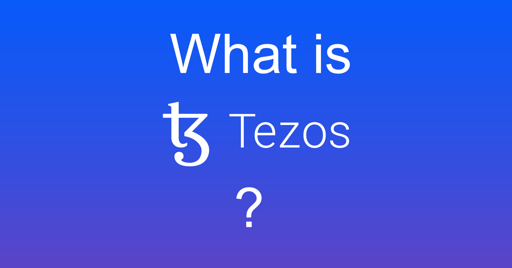
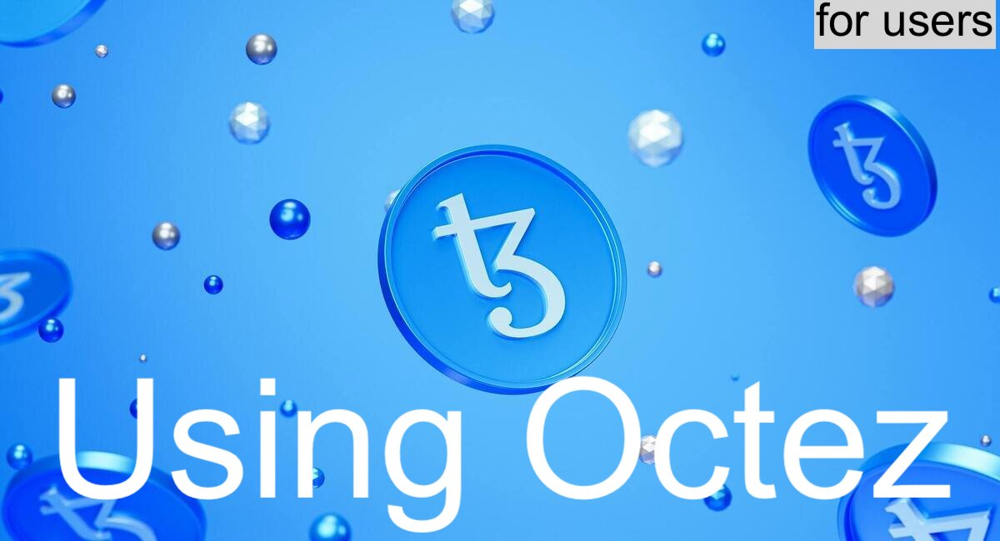
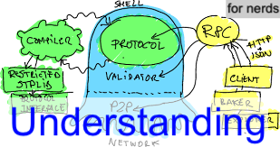
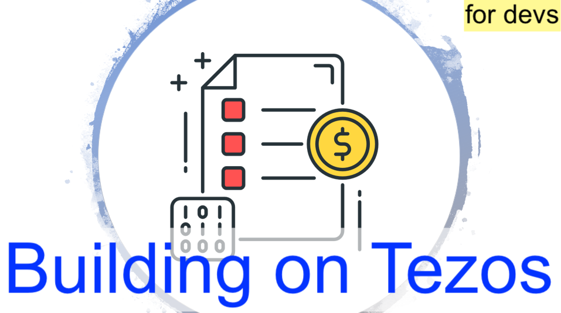

.. Tezos documentation master file, created by
   sphinx-quickstart on Sat Nov 11 11:08:48 2017.
   You can adapt this file completely to your liking, but it should at least
   contain the root `toctree` directive.

.. TODO https://gitlab.com/tezos/tezos/-/issues/2170:
   search shifted protocol name/number & adapt

Welcome to the Tezos Developer Documentation!
=============================================

To start browsing, either follow one of the guided paths below, or directly pick any topics in the documentation menu.

.. _tezos_project:

The Tezos Project
-----------------

Tezos is a distributed consensus platform with meta-consensus
capability. Tezos not only comes to consensus about the state of its ledger,
like Bitcoin or Ethereum. It also attempts to come to consensus about how the
protocol and the nodes should adapt and upgrade.
The website https://tezos.com/ contains more information about the project.

.. _octez:

Octez
~~~~~

Octez is an implementation of Tezos software, including a node, a client, a baker, an accuser, and other tools, distributed with the Tezos economic protocols of Mainnet for convenience.
This implementation is available at https://gitlab.com/tezos/tezos.
The source code is placed under the MIT Open Source License.

The current release of Octez is :doc:`../releases/version-15`.

.. _tezos_community:

The Community
~~~~~~~~~~~~~

- The website of the `Tezos Foundation <https://tezos.foundation/>`_.
- `Tezos sub-reddit <https://www.reddit.com/r/tezos/>`_ is an
  important meeting point of the community.
- Several community-built block explorers are available:

    - https://tzstats.com
    - https://tzkt.io (Baking focused explorer)
    - https://arronax.io (Analytics-oriented explorer)
    - https://mininax.io
    - https://baking-bad.org (Baking rewards tracker)
    - https://better-call.dev (Smart contracts explorer)

- A few community-run websites collect useful Tezos links:

    - https://www.tezos.help
    - https://tezoscommons.org/
    - https://tqtezos.com/

- More resources can be found in the :doc:`introduction/support` page.

Mainnet
~~~~~~~

The Tezos network is the current incarnation of the Tezos blockchain.
It runs with real tez that have been allocated to the
donors of July 2017 ICO (see :ref:`activate_fundraiser_account`).

The Tezos network has been live and open since June 30th 2018.

All the instructions in this documentation are valid for Mainnet
however we **strongly** encourage users to first try all the
introduction tutorials on some :ref:`test network <test-networks>` to familiarize themselves without
risks.

Test Networks
~~~~~~~~~~~~~

There are several test networks for the Tezos blockchain with a
faucet to obtain free tez (see :ref:`faucet`).
These networks are intended for developers wanting to test their
software before going to beta and for users who want to familiarize
themselves with Tezos before using their real tez.

See the list of test networks in :ref:`test network <test-networks>`.

Guided paths
------------

The following subsection provide some guided paths to the documentation available on this website.
A complete map of the website is provided at the botton of this page.

.. _getting_started:

Getting started
~~~~~~~~~~~~~~~

The best place to start exploring the project is following the ``Introduction`` section in the documentation menu.

These tutorials explain how to :doc:`get the latest implementation of Octez <introduction/howtoget>` in various forms, how to :doc:`start using Octez to join Tezos <introduction/howtouse>`, different :doc:`ways to participate to the network <introduction/howtorun>`, and more.

.. _tezos_users:

Using Tezos/Octez
~~~~~~~~~~~~~~~~~

If you already installed Octez and can participate to the Tezos blockchain, the most useful resources are grouped in the ``User`` section in the documentation menu.
These pages:

- present the key concepts and mechanisms for setting up Octez, including :doc:`user/setup-client`, :doc:`user/setup-node`, and so on;
- empowers you to take advantage of Octez' basic and more advanced features, such as :doc:`user/key-management`, :doc:`user/multisig`, :doc:`user/logging`, and much more.

If you intend to participate to Tezos not just as a mere user, but also as a baker, you could also check more specialized resources such as the `NL Knowledge Center <https://docs.nomadic-labs.com/nomadic-labs-knowledge-center/>`__ or `Open Tezos <https://opentezos.com>`__.

.. _understanding_tezos:

Understanding Tezos/Octez
~~~~~~~~~~~~~~~~~~~~~~~~~

If you want to know more about the Tezos *technology*, there are several sections in the documentation presenting the main design principles of Tezos, and some high-level implementation principles of Octez:

- Section ``Shell`` introduces the common :ref:`architectural principles of any Tezos implementation <the_big_picture>`, mainly consisting of a "shell" and a "protocol". It also presents in particular the :ref:`architectural principles of the Octez implementation <packages>`. A group of pages in this section detail some major subsystems of :doc:`shell/shell`.

- Sections named ``<name> Protocol`` explain the design principles and the salient features of several Tezos protocols, current or upcoming, such as: the :doc:`the active protocol <active/protocol>`, a :doc:`protocol proposal under development <alpha/protocol>`, and possibly some protocol(s) that are currently candidate(s) for future adoption.

.. _tezos_devs:

Building on Tezos
~~~~~~~~~~~~~~~~~

Tezos is an open platform. As any programmable blockchain, its value lies in the increasing base of smart contracts and distributed applications covering various domains, but also in the tools that make the ecosystem easier to use and more efficient, such as wallets, indexers, and many others.

For Tezos developers, this website mostly provides API documentation, but also some guidelines, including:

- A complete reference of :doc:`active/michelson`
- Important API concepts such as the :doc:`developer/rpc`
- API references such as :doc:`shell/rpc`, :doc:`api/openapi`, or :doc:`api/errors`
- Guidelines for writing smart contracts, such as :doc:`developer/michelson_anti_patterns`.

If you are looking for a more accessible and pedagogical exposition on how to write smart contracts or Dapps, there are many great resources out there for developing on Tezos, such as the `Tezos Developer Portal <https://developers.tezos.com>`__ and `Open Tezos <https://opentezos.com>`__.

.. _octez_devs:

Contributing to Octez
~~~~~~~~~~~~~~~~~~~~~

The main focus of this technical documentation website is on resources for core developers, that is, contributors to the Tezos platform, and in particular to its Octez implementation.

Core developers can find a rich set of explanations, tutorials, and howtos, mainly in the ``Developer`` section, including:

- a tutorial on the various forms of contributing (:doc:`developer/contributing`), and guidelines such as :doc:`developer/guidelines`
- programming tutorials covering various libraries and frameworks specific to the Octez OCaml implementation, such as using :doc:`developer/gadt`, using :doc:`developer/error_monad`, using :doc:`developer/clic`, :doc:`developer/event_logging_framework`, etc.
- howtos for specific maintenance tasks such as :doc:`developer/michelson_instructions`, :doc:`developer/protocol_environment_upgrade`, or :doc:`developer/howto-freeze-protocols`
- a whole subsection on the :doc:`various testing frameworks <developer/testing_index>` for Octez, explaining how to use them and how to add different kinds of tests
- presentations of various tools for core developers, such as support for :doc:`developer/profiling` and :doc:`developer/snoop`.

Core developers are also provided reference materials for internal APIs of Octez, such as:

- The :doc:`API of OCaml libraries and modules <api/api-inline>` reference
- The :doc:`shell/p2p_api` reference
- The :doc:`developer/merkle-proof-encoding-formats` reference.

Website map
-----------

This website (https://tezos.gitlab.io/) provides online developer documentation.
This documentation is about Octez, although it also documents Tezos in general.

The developer documentation is automatically generated from the master branch
of the above repository.

The map of this website is detailed next.
Enjoy learning about Octez and Tezos, how to use them, build on top of them, or contribute to the platftorm!

.. toctree::
   :maxdepth: 2
   :caption: Introduction:

   introduction/howtoget
   introduction/howtouse
   introduction/howtorun
   introduction/test_networks
   introduction/get_troubleshooting
   introduction/support

.. toctree::
   :maxdepth: 2
   :caption: User doc:

   user/versioning
   user/setup-client
   user/setup-node
   user/proxy-server
   user/multisig
   user/fa12
   user/logging
   user/various

.. toctree::
   :maxdepth: 2
   :caption: Shell doc:

   shell/the_big_picture
   shell/shell
   shell/p2p_api
   shell/cli-commands
   shell/rpc

.. toctree::
   :maxdepth: 2
   :caption: Lima Protocol doc:

   active/protocol
   active/glossary
   active/cli-commands
   active/rpc

.. toctree::
   :maxdepth: 2
   :caption: Mumbai Protocol doc:

   mumbai/protocol
   mumbai/glossary
   mumbai/cli-commands
   mumbai/rpc

.. toctree::
   :maxdepth: 2
   :caption: Alpha Development Protocol doc:

   alpha/protocol
   alpha/glossary
   alpha/cli-commands
   alpha/rpc

.. toctree::
   :maxdepth: 2
   :caption: Developer doc:

   developer/rpc
   developer/encodings
   developer/data_encoding
   developer/merkle-proof-encoding-formats
   developer/gadt
   developer/error_monad
   developer/clic
   developer/michelson_anti_patterns
   developer/michelson_instructions
   developer/entering_alpha
   developer/protocol_release_checklist
   developer/howto-freeze-protocols
   developer/protocol_environment_upgrade
   developer/event_logging_framework
   developer/testing_index
   developer/profiling
   developer/snoop
   developer/contributing
   developer/merge_team
   developer/guidelines
   developer/repository_scope
   developer/time_measurement_ppx
   developer/openmetrics
   README

.. toctree::
   :maxdepth: 2
   :caption: Protocols:

   protocols/naming
   protocols/013_jakarta
   protocols/014_kathmandu
   protocols/015_lima
   protocols/016_mumbai
   protocols/alpha
   protocols/history

.. toctree::
   :maxdepth: 2
   :caption: Releases:

   releases/releases
   releases/version-15
   releases/history

.. toctree::
   :maxdepth: 2
   :caption: APIs:

   api/api-inline
   api/openapi
   api/errors

Indices and tables
==================

* :ref:`genindex`
* :ref:`search`
