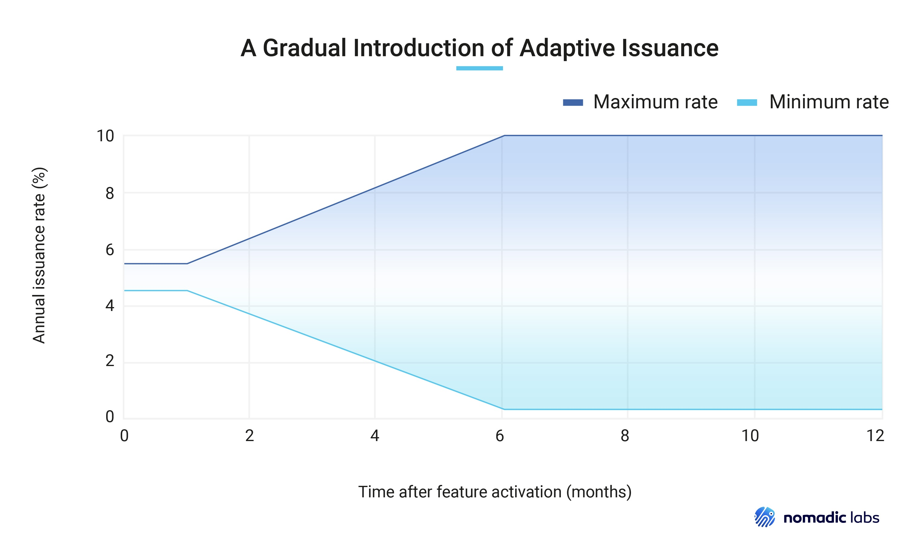
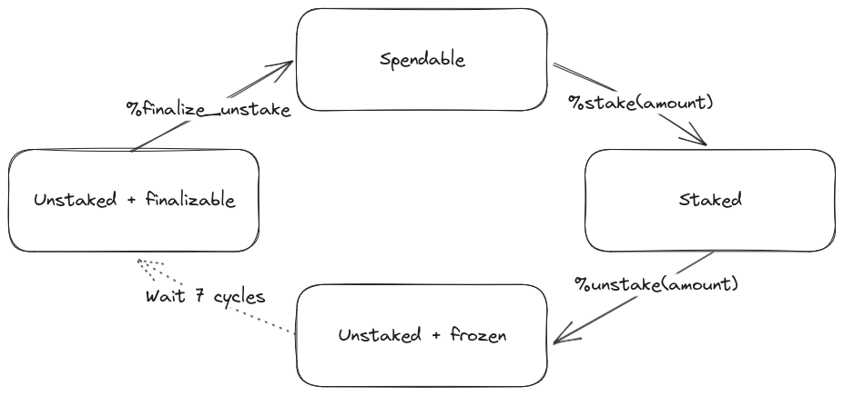

:math:`\newcommand\F[2]{\mathit{#1}\left(#2\right)}`
:math:`\newcommand{\minR}{\mathit{min_r}}`
:math:`\newcommand{\maxR}{\mathit{max_r}}`
:math:`\newcommand{\tmult}{\cdot}`
:math:`\newcommand\static[1]{\F{static}{#1}}`
:math:`\newcommand{\sfr}{\frac{1}{1600}}` :math:`\newcommand\tc{\tau_c}`
:math:`\newcommand\tr{\tau_r}` :math:`\newcommand\grf{\gamma}`
:math:`\newcommand\dyn[1]{\F{dyn}{#1}}`
:math:`\newcommand\sgn[1]{\F{sign}{#1}}`
:math:`\newcommand\dist[1]{\F{distance}{#1}}`
:math:`\newcommand\DTF{{\Delta t}}`
:math:`\newcommand\IL[1]{\normalsize{#1}}`
:math:`\newcommand\MX[2]{\F{max}{#1,#2}}`
:math:`\newcommand\adr[1]{\F{adaptive}{#1}}`
:math:`\newcommand\clip[3]{\F{clip}{#1,#2,#3}}`
:math:`\newcommand\supply[1]{\F{supply}{#1}}`
:math:`\newcommand\iss[1]{\F{issuance}{#1}}`
:math:`\newcommand\isb[1]{\F{issuance_{block}}{#1}}`
:math:`\newcommand\tw{\Sigma_w}`
:math:`\newcommand\rw[2]{\F{reward_{#1}}{#2}}`
:math:`\newcommand\tip[2]{\F{tip_{#1}}{#2}}`
:math:`\newcommand\exp[1]{\F{exp}{#1}}`
:math:`\newcommand{\vdf}{\mathit{VDF}}`

=============================
Adaptive Issuance and Staking
=============================

This document describes Adaptive Issuance and Staking, two new features (referred hereafter as the Adaptive-Issuance/Staking proposal) which together constitute a major evolution of Tezos’ :doc:`Proof-of-Stake mechanism <proof_of_stake>`.

.. note::

  For operational details about the new staking mechanism and its configuration, see `a new staking mechanism tutorial <https://docs.google.com/document/d/1-1WTG2Vuez9D8fROTJrs42twbIErR16xyknRRBrjr-A/edit?usp=sharing>`__.

.. _adaptive_issuance:
.. _adaptive_issuance_paris:

Adaptive Issuance
=================

Adaptive Issuance is a novel mechanism regulating tez issuance in Tezos.

The :doc:`Tezos economic protocol <./protocol>` issues new
tez via:

-  Participation rewards: incentives given to delegates for
   :doc:`participation in consensus <consensus>`
   and random seed generation.
-  The :doc:`Liquidity Baking (LB) subsidy <liquidity_baking>`.
-  Protocol "invoices": lump sums of tez issued and allocated during
   protocol migration.

Participation rewards and the LB subsidy are regularly issued by the
protocol, whereas the value and recipients of invoices are defined
discretionarily by the developers of a protocol proposal.
The values for participation rewards and
the LB subsidy, if any, are currently defined by the Tezos protocol using fixed
constants.

Adaptive Issuance lets the amount of participation rewards depend on
the global **staked ratio** – that is, the
ratio of staked tez to the total supply. This lets issuance roughly
match the *actual* security budget the chain requires, the amount needed
to encourage participants to stake and produce blocks, but *no more*.

At the end of each blockchain :ref:`cycle <def_cycle_paris>`, the
regular issuance is adjusted, to nudge the staked ratio towards a
protocol-defined target (set at 50% in the Adaptive-Issuance/Staking proposal). Participation rewards
are recomputed to match that budget. When the staked
ratio decreases and diverges from the target, emission rates
increase, incentivizing participants to stake funds to re-approach the
target. Conversely, incentives decrease as the ratio increases beyond
the target.

.. _adaptive_issuance_rate:
.. _adaptive_issuance_rate_paris:

Adaptive issuance rate
----------------------

The adaptive issuance rate determines, at the end
of cycle :math:`\IL{c}`, the issuance for cycle :math:`\IL{c + 3}`. The
adaptive issuance rate is the sum of a :ref:`static rate <static_rate_paris>`
and a :ref:`dynamic rate <dynamic_rate_paris>`. This value is kept within
a minimal and a maximal value, to ensure nominal emissions remain within
reasonable bounds.

.. _staked_ratio:
.. _staked_ratio_paris:

Staked ratio
............

The **staked ratio** is the ratio of staked tez to the total supply. It is computed at the end of a given ``cycle``:

.. code-block:: python

  def staked_ratio(cycle):
    return total_frozen_stake(cycle + 1 + consensus_rights_delay) / total_supply(cycle)

Where:

- ``consensus_rights_delay`` (2) is the delay in cycles for a delegate to receive rights.
- ``total_supply(cycle)`` returns the total supply of tez at the end of the given ``cycle``.
- ``total_frozen_stake(cycle)`` returns the total frozen stake at the given ``cycle``.

.. _static_rate:
.. _static_rate_paris:

Static rate
...........

The **static rate** is a mechanism which approximates `a Dutch
auction <https://en.wikipedia.org/wiki/Dutch_auction>`__ to compute a
nominal issuance rate as a function of the staked ratio for a
given cycle. Its value decreases as the staked ratio increases.
The static rate is defined as follows:

.. code-block:: python

  def static_rate(cycle):
    return 1 / 1600 * (1 / (staked_ratio(cycle) ** 2))

The choice of a scaling factor ensures that the curve takes reasonable values for plausible staked ratios. Moreover, since Adaptive Issuance is activated with a dynamic rate of 0, and at current staked ratio (that is, ~7.5% of the total supply), this factor allows for a smooth transition from current issuance rate (~4.6%).

.. _dynamic_rate:
.. _dynamic_rate_paris:

Dynamic rate
............

The **dynamic reward rate** adjusts itself over time based on the distance between the staked ratio and the 50% (±2%) target ratio, increasing when < 48% and decreasing when > 52%. The dynamic rate is defined as follows:

.. code-block:: python

  def dynamic_rate(cycle):
    if cycle <= ai_activation_cycle:
      return 0
    seconds_per_cycle = blocks_per_cycle * minimal_block_delay
    days_per_cycle = seconds_per_cycle / 86400
    previous_dynamic = dynamic_rate(cycle - 1)
    staked_ratio = staked_ratio(cycle)
    if staked_ratio < 0.48:
      delta_d = (0.48 - staked_ratio) * growth_rate * days_per_cycle
    elif staked_ratio > 0.52:
      delta_d = (0.52 - staked_ratio) * growth_rate * days_per_cycle
    else:
      delta_d = 0
    return previous_dynamic + delta_d

Where:

- ``blocks_per_cycle`` denotes the number of blocks in a Tezos cycle.
- ``minimal_block_delay`` denotes the minimal duration of a block in seconds.
- ``days_per_cycle`` denotes the minimal duration in days of a Tezos cycle, assuming all blocks in the cycle are produced at the minimal allowed time – that is, every 10 seconds in Paris.
- ``growth_rate`` controls the speed at which the dynamic rate adjusts. The value is set so that a one percentage point deviation of the staked ratio changes the dynamic rate by 0.01 percentage points per day.

In a nutshell, ``dynamic_rate(c)`` increases and decreases by an amount proportional to the distance between the target rate and the interval ``[48%; 52%]``. Note that to ensure that the issuance rate is kept within :ref:`the minimum and maximum bounds <minimum_and_maximum_rates_paris>`, the dynamic rate might be adjusted accordingly. More precisely, if :ref:`the issuance rate <issuance_rate_alpha>` would surpass the maximum issuance allowed for a given cycle, then ``dynamic_rate(c)`` would be reduced to keep the issuance rate within the bounds (this part of the formula has been omitted from the above pseudocode for brevity). In addition, the ``dynamic_rate`` can never exceed the ``max_bonus`` value defined as a protocol parameter, which is 5% on mainnet.

.. _minimum_and_maximum_rates:
.. _minimum_and_maximum_rates_paris:

Minimum and maximum rates
..........................

Starting in Paris, the minimum and maximum
issuance rates will evolve slowly over a set period of time,
so that the range of possible issuance rate values widens progressively.

The following figure describes the progressive maximum and minimum
values of Adaptive Issuance.

 Figure 1. A gradual widening of the range ensures a smooth transition
 to Adaptive Issuance.

The schedule consists of three periods:

- an **initial** period, set to 1 month, where the minimum and maximum
  issuance rates are close to the current issuance rate and stay
  constant,
- a **transition** period, set to 5 months, where they evolve linearly, with
  a decreasing minimum, and an increasing maximum, and
- a **final** period where the minimum and maximum have reached their
  final values.

Formally, the functions for the minimum and maximum values are piecewise linear functions of time,
and can be generally defined as follows:

.. code-block:: python

  def compute_extremum(cycle, initial_value, final_value):
    trans = transition_period + 1
    initial_limit = ai_activation_cycle + initial_period
    trans_limit = initial_limit + trans
    if cycle <= initial_limit:
        return initial_value
    elif cycle >= trans_limit:
        return final_value
    else:
        t = cycle - initial_limit
        res = (t * (final_value - initial_value) / trans) + initial_value
        return res

Where:

- ``ai_activation_cycle`` is the first cycle with Adaptive Issuance active.
- ``initial_period`` is a predefined period of time, set to 1 month in Paris.
- ``transition_period`` is a predefined period of time, set to 5 months in Paris.

The issuance minimum rate for Adaptive Issuance curve is then defined as follows.

.. code-block:: python

  def minimum_rate(cycle):
    return compute_extremum(cycle, issuance_initial_min, issuance_global_min)

Where:

- ``issuance_initial_min`` (4.5%) is the initial minimum value. At the time of Adaptive Issuance‘s activation, the issuance rate is kept above this bound for the initial period.
- ``issuance_global_min`` (0.25%) is the final value for the lower bound, reached at the end of the transition period.

The issuance maximum rate for Adaptive Issuance curve is then defined as follows.

.. code-block:: python

  def maximum_rate(cycle):
    return compute_extremum(cycle, issuance_initial_max, issuance_global_max)

Where:

- ``issuance_initial_max`` (5.5%) controls the initial maximum value. At the time of Adaptive Issuance‘s activation, the issuance rate is kept below this bound for the initial period.
- ``issuance_global_max`` (10%) is the final value for the upper bound, reached at the end of the transition period.

.. _issuance_rate:
.. _issuance_rate_paris:

Issuance rate
......................

Finally, as mentioned before, the nominal adaptive issuance rate [1]_ for a cycle ``c + consensus_rights_delay + 1`` is defined as the sum of the static rate and the dynamic rate computed for the cycle ``c``, bounded within the minimum and maximum rates computed for the cycle ``c + 1``.

.. code-block:: python

  def issuance_rate(cycle):
    adjusted_cycle = cycle - consensus_rights_delay
    static_rate = static_rate(adjusted_cycle - 1)
    dynamic_rate = dynamic_rate(adjusted_cycle - 1)
    minimum_rate = minimum_rate(adjusted_cycle)
    maximum_rate = maximum_rate(adjusted_cycle)
    total_rate = static_rate + dynamic_rate
    return max( min(total_rate, maximum_rate), minimum_rate )

.. _adaptive_rewards:
.. _adaptive_rewards_paris:

Adaptive rewards
----------------

Before :ref:`Adaptive Issuance activation<feature_activation_paris>`,
participation rewards are fixed values defined by protocol
constants. With the new mechanism, the adaptive issuance rate provides
instead a budget for the whole cycle, which gets allocated equally to
each block of the cycle and distributed between the various rewards,
in proportion to their relative :ref:`weights
<rewards_weights_paris>`.

.. _rewards_weights:
.. _rewards_weights_paris:

Reward weights
..............

The Adaptive-Issuance/Staking proposal defines the weights for participation rewards as:

- Attestation (formerly, endorsing) rewards: 10,240.
- Fixed baking reward: 5,120.
- Bonus baking reward: 5,120.
- Nonce revelation tip: 1.
- VDF tip: 1.

The total sum ``sum_rewards_weight`` of all weights is 20482.

.. code-block:: python

  sum_rewards_weight = (
    attestation_rewards +
    fixed_baking_rewards +
    bonus_baking_rewards +
    nonce_revelation_tip +
    vdf_tip)

The coefficient to apply for reward computation is defined as follows.

.. code-block:: python

  def reward_coeff(cycle):
    if cycle < ai_activation_cycle:
      return 1
    rate = issuance_rate(cycle)
    total_supply = total_supply(cycle - consensus_rights_delay - 1)
    return (rate / 525600) * total_supply / base_total_issued_per_minute

Where:

- ``base_total_issued_per_minute`` (80007812) is the expected amount of mutez issued per minute.
- 525600 is the number of minutes per year.

The issuance per block is then distributed amongst the different rewards in proportion to their weight.

.. code-block:: python

  def tez_from_weights(weight):
    num = weight * minimal_block_delay
    den = sum_rewards_weight * 60
    return base_total_issued_per_minute * num / den

  def reward_from_constants(cycle, weight):
    return tez_from_weights(weight) * reward_coeff(cycle)

**Consensus rewards.** Since the adoption of Tenderbake, Tezos protocols
before the Adaptive-Issuance/Staking proposal have rewarded delegates :doc:`for their participation in
consensus <consensus>`
with the following rewards per block:

-  A fixed **baking** reward, given to the delegate which produced the
   *payload* of the block (i.e. choosing transactions, and other
   non-consensus operations).
-  A variable, baking **bonus** reward given to the delegate which
   produced the block included in the chain. This bonus is given for
   including attestations, if their combined attesting power exceeds the
   minimal threshold (two thirds of total slots).
-  A *collective* **attestation** reward, for attesting block proposals,
   distributed at the end of the cycle to the delegates selected in the
   consensus committees for that cycle, proportionnaly to their expected
   participation.

We refer to :doc:`the consensus page <consensus>` for
further insight on the pre-requisites and distribution of these rewards.
Here, we derive the new functions which compute their values per block.

.. code-block:: python

  def baking_reward_fixed_portion(cycle):
    return reward_from_constants(cycle, fixed_baking_rewards)

  def baking_reward_bonus_per_slot(cycle):
    bonus_committee_size = consensus_committee_size - consensus_threshold
    return reward_from_constants(cycle, bonus_baking_rewards) / bonus_committee_size

  def attestation_reward_per_slot(cycle):
    return reward_from_constants(cycle, attestation_rewards) / consensus_committee_size

Where:

- ``consensus_committee_size`` (7000) is the number of attestation slots available in a block.
- ``consensus_threshold`` (4667) is the required number of attestations for a baker to propose a block.

**Nonce and VDF revelation tips.** The rewards allocated to delegates
for contributing to :ref:`random seed generation <randomness_generation_paris>`
(that is, for revealing nonce seeds and posting VDF proofs) are not paid
each block, but rather every 192 blocks.

.. code-block:: python

  def seed_nonce_revelation_tip(cycle):
    return reward_from_constants(cycle, nonce_revelation_tip * blocks_per_commitment)

  def vdf_revelation_tip(cycle):
    return reward_from_constants(cycle, vdf_tip * blocks_per_commitment)

Where:

- ``blocks_per_commitment`` (192) is the interval in blocks between each revelation, both VDF and nonce.

The Adaptive-Issuance/Staking proposal implements a new `RPC
endpoint <https://tezos.gitlab.io/paris/rpc.html#get-block-id-context-issuance-expected-issuance>`__,
``/issuance/expected_issuance``, which reports the precomputed values of
all participation rewards, for the provided block and the next
``consensus_rights_delay`` cycles.

.. _new_staking:
.. _new_staking_paris:

New Staking mechanism
=====================

Staking is an evolution of the existing Tezos :doc:`Liquid Proof-of-Stake
mechanism <proof_of_stake>`. It
introduces a new role for network participants, called **staker**,
complementary to the existing :ref:`delegate <def_delegate_paris>`
(also known as *baker*) and *delegator* roles. A staker must also be a
*delegator* – that is, they must first choose a delegate.

When stakers **stake** funds towards a delegate’s **staking**
**balance**, the associated **baking** and **voting powers** accrue to
that delegate. Similarly to how delegated funds work, staked funds
remain within the staker’s account at all times.

Staked and delegated funds **have different weights** in the computation
of delegates’ baking and voting powers: staked funds (both external
stakes by stakers and the delegate’s own) count **twice** as much as
delegated funds.

Unlike delegated funds, staked funds are considered to contribute to the
security deposit associated with their chosen delegate. Thus, they are
subject to :ref:`slashing <slashing_paris>` if
the delegate misbehaves by :ref:`double-signing <def_double_signing_paris>`
block proposals or consensus operations, and are subject to the same
withdrawal delays – colloquially, they are "frozen".

Stakers are slashed proportionally to their contribution to the
delegate’s staking balance. To simplify slashing, double-baking
penalties are now proportional to staked funds: instead of the previous
fixed sum of 640 tez they are now set to 5% of the delegate’s stake.
Moreover, denunciation rewards (both for double-baking and
double-attestations) are reduced from one half to one seventh of the
slashed funds. The chosen value prevents adversarial delegates from
abusing the slashing mechanism for profit at the expense of their
stakers.

*Delegates* :ref:`configure their staking
policy <staking_policy_configuration_paris>` by setting staking parameters
which regulate whether they accept stakers (the default being to reject
them), and if so, up to which fraction of their total staking balance.
They can also configure which proportion of the staking rewards from other stakers is set
to accrue to their own staked balance instead.
As :ref:`participation rewards <adaptive_rewards_paris>` are
automatically shared between delegates and their
stakers, delegates can use this parameter to collect an *edge* from the
rewards attributable to their stakers.

After :ref:`the activation of Adaptive Issuance and
Staking<feature_activation_paris>`, freezing and unfreezing of staked
funds
will be controlled directly by delegates and stakers, and will no longer
be automatic. This entails that staked funds are frozen until manually
unfrozen by stakers. This is a two step process which spans for at least
4 cycles (cf. :ref:`Staked funds management <staked_funds_management_paris>`).

A new user interface is provided for delegates and stakers to interact
with the mechanism. It is based on four *pseudo-operations*: ``stake``,
``unstake``, ``finalize_unstake``, and ``set_delegate_parameters``.
Pseudo-operations are self-transfers: a transfer operation where the
destination matches the source – each involving a special entry-point of
the same name introduced for :ref:`implicit accounts <def_implicit_account_paris>`.
This approach was chosen to minimize the work required by wallets,
custodians, exchanges, and other parties to support the functionality.

**NB** Until :ref:`the activation of Adaptive Issuance and Staking
<feature_activation_paris>`, only
*delegates* can stake funds and the relative weight of staked and
delegated funds remains unchanged. In the current implementation, only
*implicit accounts* can become stakers. In other words, smart contracts
cannot stake funds (they can of course still delegate them).

.. _staking_policy_configuration:
.. _staking_policy_configuration_paris:

Staking policy configuration
----------------------------

*Delegates* can configure their staking policy by setting the following
parameters:

-  ``edge_of_baking_over_staking``: a ratio between 0 and 1, whose
   default value is 1. This parameter determines the fraction of the
   rewards that accrue to the delegate's frozen deposit – the
   remainder is shared among its stakers.
-  ``limit_of_staking_over_baking``: a non-negative number, denoting the
   maximum portion of external stake by stakers over the delegate’s own
   staked funds. It defaults to 0 – which entails that delegates do not
   accept external stakes by default. It is moreover capped by a global
   constant, set to 5 in the Adaptive-Issuance/Staking proposal, which ensures the baker controls a
   significant part of the stake.

Delegates can modify these staking parameters at all times, using the
``set_delegate_parameters`` pseudo-operation: that is, by transferring 0
tez to their own ``set_delegate_parameters`` entry-point. The chosen values for both
parameters need to be supplied. The new parameters are then applied
``DELEGATE_PARAMETERS_ACTIVATION_DELAY`` (currently 5) cycles later.

::

   octez-client transfer 0 from <delegate> to  <delegate> --entrypoint set_delegate_parameters --arg "Pair <limit as int value in millionth> (Pair <edge as int value in billionth> Unit)"

or more conveniently::

   octez-client set delegate parameters for  <delegate> --limit-of-staking-over-baking <value> --edge-of-baking-over-staking <value>

**On overstaking and overdelegation.** Note that if a delegate’s
``limit_of_staking_over_baking`` is exceeded (that is, the delegate is
*overstaked*), the exceeding stake is automatically considered as
*delegation* for the delegate’s baking and voting power calculation, but
it does remain slashable. The new mechanism does not alter
*overdelegation* (delegated funds beyond 9 times the delegate’s own
stake) nor its consequence on voting and baking powers. That is,
overdelegated funds are not counted towards a delegate baking power, but
they do increase their voting power.

.. _staked_funds_management:
.. _staked_funds_management_paris:

Staked funds management
-----------------------

Stakers (and delegates) can use the ``stake``, ``unstake``, and
``finalize_unstake`` pseudo-operations to control their stakes. Figure
2 illustrates their effect on a staker’s funds. Note that
while these pseudo-operations change the *state* of the involved funds,
they remain otherwise within the staker’s account at all times.

  Figure 2: staked funds management using pseudo-operations.

To *stake* funds, a delegator uses the ``stake`` pseudo-operation,
transferring the chosen amount of **spendable** tez to their own
``stake`` entry-point. The **staked** tez will then be frozen and
contribute to their chosen delegate’s staking balance. Note that the
``stake`` pseudo-operation will fail if the sender account is not
*delegated*.

::

   octez-client transfer <amount> from <staker> to <staker> --entrypoint stake

or more conveniently::

   octez-client stake <amount> for <staker>

To *unstake* funds, a staker first submits an unstake request with the
``unstake`` pseudo-operation. This is implemented by transferring the
chosen amount in tez to their ``unstake`` entry-point::

   octez-client transfer <amount> from <staker> to <staker> --entrypoint unstake

or more conveniently::

   octez-client unstake <amount|"everything"> for <staker>

The requested amount will be **unstaked** but will remain **frozen**.
After 4 cycles, unstaked frozen tokens are no longer considered at stake
nor slashable. They are said then to be both **unstaked** and
**finalizable**.

A staker can retrieve all unstaked and finalizable tokens at any time,
making them spendable again. This is done using the ``finalize_unstake``
entrypoint -– that is, by transferring 0 tez to their
``finalize_unstake`` entry-point::

   octez-client transfer 0 from <staker> to <staker> --entrypoint finalize_unstake

or more conveniently::

   octez-client finalize unstake for <staker>

In some circumstances, unstake and finalize can be done implicitly: any call
to ``stake`` or ``unstake`` will implicitly finalize all currently finalizable pending
unstake requests. Also, as we will see next, change of delegate triggers an
unstake operation.

Change of delegate
------------------

When a staker changes its delegate, the operation will trigger an implicit unstake
request for the full frozen deposit of the staker.

As long as the unstake request is not finalized, the frozen tokens will continue
to be delegated to the old delegate, however the spending
balance of the account is accounted in the new delegate's stake.
It will not be possible to stake with the new delegate as long as there are
unfinalizable unstake request for token staked with the old delegate.

.. _feature_activation:
.. _feature_activation_paris:

Activation of Adaptive Issuance and Staking
===========================================

The Adaptive Issuance and Staking features will not be active
immediately at the start of the Paris protocol. Instead, Adaptive
Issuance and Staking will be automatically activated **5 cycles, that
is, around 2 weeks** after the activation of Paris, in order to give
the community enough time to get ready for these features.

Here is the list of features and related changes that will only become
active 5 cycles into the Paris protocol:

-  Adaptive issuance – including notably the changes to the computation
   of consensus rewards.
-  Ability for *delegators* to become *stakers* – until feature
   activation delegates continue to be the only participants who can
   **stake** funds.
-  The changes in weight for staked and delegated funds towards the
   computation of baking and voting rights.
-  The new interface for stake manipulation based on
   *pseudo-operations*. Note that this entails the deprecation of the
   ``set/unset deposits limit`` interface and also the end of automatic
   deposit freezing. On protocol activation, each delegate’s stake is
   derived from the frozen deposits at the end of the last cycle of
   Nairobi.
-  The changes in slashing penalties (double-baking penalties are set to
   5% of the staked funds) and denunciation rewards (they amount to one
   seventh of slashed funds).
-  Changes to protocol constants. Note that this entails calculating
   participation rewards using the weight-based
   formulas, but these are defined so that they match the previous
   values when :ref:`Adaptive Issuance <adaptive_issuance_paris>` is not active.

.. [1]
   Note that if the nominal annual issuance rate is :math:`r`, the
   annualized rate is close to :math:`\IL{\exp{r} - 1}` as it is
   compounded at every cycle.
