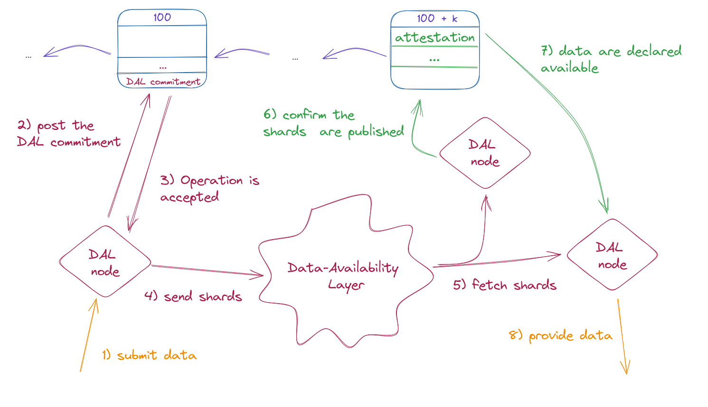

============
DAL overview
============

The *Data-Availability Layer* (DAL) enables users to publish blobs
of data outside of the Tezos Layer 1 (L1) blocks. A blob (for “binary
large object”) is a piece of data in binary form. Currently, the primary
use case for these blobs is to represent Layer 2 (L2) operations for Tezos
smart rollups, but the DAL is more generic
and could be used for other use cases in the future.

In practice, the DAL is implemented by a network of *DAL nodes*, constituting a *DAL network*.
The DAL network employs a P2P protocol to publish blobs
(distinct from :doc:`the P2P layer used by the Octez node <../shell/p2p>`), enabling a better bandwidth sharing between the peers (further
elaborated in the P2P section below). The DAL currently supports a
data bandwidth of 0.5MiB/s, a stark contrast to the current situation on
L1, which has an approximate bandwidth of 32 KiB/s. This highlights
the significant boost in bandwidth provided by the DAL.
Furthermore, the DAL aims to put back by several orders of magnitudes the data bandwidth constraints imposed by the L1 block size, up to 100MiB/s. This
translates into reduced fees for users when posting L2 operations
without compromising the fundamental principle of decentralization.

The amount of data that can be transmitted over the DAL network is,
however, still controlled by the economic protocol. The economic
protocol also plays a crucial role in determining the availability of
those data through the participation of bakers.

Similarly to the Tezos L1, the DAL is permissionless, enabling any
user to effectively contribute data to it, and allowing any smart
rollup kernel to access this data.

|DAL overview|

The figure illustrates the standard process for interacting with the
DAL as follows:

The diagram depicts a scenario where a user intends to upload data for
a dedicated rollup.

Anyone engaging with the DAL must utilize a DAL
node, implemented by a binary named ``octez-dal-node``. When a user decides to provide a new
blob to the DAL (depicted as step 1 in the diagram), the user
transmits the data to the DAL node to calculate a commitment to the
data. This commitment is then communicated to L1 via a dedicated
operation (indicated as step 2). Following L1’s approval of this
operation (step 3), the DAL expands this data for redundancy,
partitions the expanded data into segments called shards, and
disseminates the shards across the DAL network (shown in step 4).
Shards are assigned to bakers proportionally to their stake by the
economic protocol. Hence, the bakers, also connected to the DAL
network, retrieve these assigned shards (step 5). The bakers must
download and verify these shards within a specific timeframe,
precisely defined by the economic protocol as the ``attestation lag``
period (see :ref:`dal_constants`). At the end of the attestation lag period, bakers declare using
an optional field of the consensus attestation operation, whether they were able to download the
shards effectively (illustrated in step 6). The economic protocol
collates these attestations and, if a sufficient number of bakers have
successfully obtained the shards, the blob is declared as available
(step 7). Only when the blob is labeled as available can the rollup
utilize it (represented as step 8).

The rationale for having the attestation lag parameter is to give
bakers sufficient time to download their assigned shards, while
guaranteeing that the latency of publishing blobs stays within acceptable limits (around one
minute).

.. _dal_slots:

DAL slots
=========

There is a limited number of blobs, called *DAL slots* (or slots for
short), that can be published at a L1 level. A slot is identified by
the L1 level at which it is published, an index, and its
commitment. Depending on the context, a “slot” may refer to the data
blob or to the placeholder (the slot index) of that blob. Each slot is
treated independently of other slots. Presently, all slots are of the
same size, though this may change with future updates. To publish a
slot, it is first expanded to create redundancy through erasure
coding, increasing its size by a factor known as the *redundancy
factor*. This expanded slot is then divided into a set of smaller data
pieces of equal size, called *shards*. Finally, shards are distributed
across the DAL P2P network.

The advantage of using erasure coding is that one only needs a subset
of the shards, specifically, “number of shards / redundancy factor” to
recover the full original slot data. A key feature for the shards is
that each shard can be verified to ensure it corresponds to a
particular commitment, which safeguards against spam in the DAL P2P
network.

For each slot index, multiple commitments can be included in a block,
but only one will be acknowledged, the first one appearing in the
block ordering. Because bakers typically prioritize operations that
offer higher fees, the commitment with the higher fee is usually
chosen for inclusion, although this outcome is not guaranteed if a
baker uses a different selection criterion.

For smart rollups, it is necessary to divide the slot into smaller
segments called *pages* (see
:ref:`populating_the_reveal_channel`). The economic protocol specifies
the size of each page as a constant, with 4KiB being a practical
size. While it might seem feasible to choose shards fitting this page
limit and directly feed shards to the rollup, accessing the original
data from shards involves complex cryptographic computations. We
prefer to avoid performing such computations within the smart
rollups. Therefore, even though the DAL network uses shards
internally, the DAL node can serve individual pages as requested by
the smart-rollup node. These pages can then be imported individually
by the smart rollup node to the kernel on demand. To reconstruct the
entire slot, one simply needs to arrange these pages in the correct
sequence. For developers working with smart-rollup kernels, the
technicalities of reconstructing the entire slot out of pages should
ideally be handled by the SDK they use, simplifying the process even
more.

.. |DAL slot| image:: dal_slot.png

|DAL slot|

When the slot producer (user publishing a slot) posts the commitment
onto the L1, it also posts a proof that the slot does not exceed the
slot size. This prevents malicious users from producing and posting
data larger than the expected size.

.. _dal_p2p:

The DAL's P2P protocol
======================

The peer-to-peer (P2P) protocol for the DAL is made out of two components:

- A gossipsub algorithm, instantiated as detailed below.
- A transport layer for handling connections with peers.
  We reuse for that the :doc:`P2P protocol used by the Octez node <p2p>`.

The gossip algorithm used for the DAL is an in-house version of the gossipsub v1.1 P2P protocol defined by the lib-p2p project. A detailed overview of this protocol is available `here <https://docs.libp2p.io/concepts/pubsub/overview/>`__ and an informal English specification can be found `here <https://github.com/libp2p/specs/blob/master/pubsub/gossipsub/gossipsub-v1.1.md>`__. This gossip algorithm allows to partition the network into virtual subnetworks, each identified by a **topic**. The topic also determines the valid data that can be exchanged over the corresponding virtual subnetwork, as any exchanged message has exactly one associated topic. Each peer subscribes to topics of interest to him. This protocol enhances the network's scalability compared to traditional gossip algorithms.

For each message, there is a **message id** that uniquely identifies this message. When a message is pushed, it comes with its message id. When the message is pulled, it is done via the message id.
For every topic a node subscribes to, it maintains a virtual subnetwork, or **mesh**, of peers also subscribed to that topic. When a node has a new message to share (originating from the application layer) or needs to relay a received message, it does so to all peers in the corresponding topic's mesh. Moreover, the node broadcasts the ids of the last received messages to a random selection of peers outside the mesh. Peers receiving these teasers can request the full message if they are interested in it.
For the DAL instantiation of gossipsub, a message is defined as a 3-tuple: a shard, the shard’s index, and the shard’s proof proving that the shard corresponds to the commitment given by the message id. The associated message id consists of the shard index and the associated slot index, (published) level, slot commitment, and attestor’s public key hash.

A topic is defined as a pair ``(slot_index, public_key_hash)``. The first component identifies the slot associated to any shard published under this topic, while the second component identifies the baker assigned to this shard.
Such a set of topics ensures that the bandwidth of bakers and slot producers is bounded (for valid messages) over a cycle.

A slot producer should subscribe to all relevant topics associated with their slot index. This includes every topic where a baker is assigned at least one shard for that slot index.
Since shard assignments are derived from the consensus committee, which is known at least one cycle in advance, slot producers can determine the relevant topics ahead of time.
On the other hand, a baker should subscribe to all topics that feature their public key address.

Gossipsub also defines a notion of score which is used to only connect to peers with a good score.

Regarding peer discovery, the current implementation of the DAL relies on gossipsub v1.1 peer exchanges. In particular, DAL nodes can be configured in bootstrap mode to facilitate peer discovery.

.. note::

	The current topic structure in the DAL for Tezos may be revised in a future update. Presently, topics include the bakers’ address (public key hash), which leads to a potentially unbounded number of topics over time. Another approach under consideration involves using a ``(slot_index, shard_index)`` pair, offering a more scalable solution in the long run, when the number of attesters surpasses the number of slots.

.. warning::

	Attention must be paid to the security implications for bakers in the DAL network. Since a baker's bandwidth is proportional to their stake, it can become relatively straightforward to identify the IP address of their DAL node, particularly for those with substantial stakes. To mitigate this risk, bakers are advised to operate their DAL node using an IP address different from their L1 node. This separation helps in preventing the unintentional exposure of the L1 node's IP address.

	Plans are underway to address these concerns. One proposed solution is to enable bakers to divide their bandwidth across multiple DAL nodes, enhancing both security and operational flexibility.
