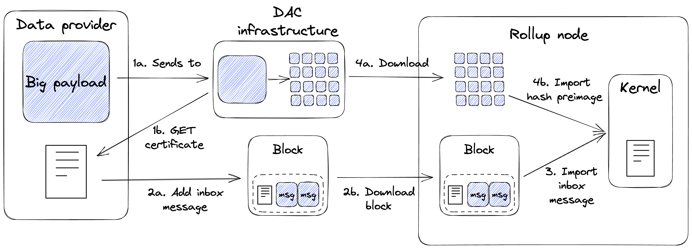

Data Availability Committees
============================
Overview
^^^^^^^^
A Data Availability Committee (DAC) is a solution to scale the data bandwidth available for off-chain applications running in :doc:`Tezos smart rollups <../active/smart_rollups>`.
It relies on a distributed network of data storage providers, subject to a slight trust assumption.
By utilizing a DAC, smart rollups bypass the data limit imposed by the Tezos block and can increase the amount of transaction data available for processing beyond that limit.

In addition to data scalability, DACs also serve as a data source for smart rollups that satisfies the following properties:

- **Integrity**: The data imported into smart rollups are verifiably correct, that is, it is possible to prove that the data has not been tampered with.

- **Availability**: Any data addressed to smart rollups are available upon request.

A DAC consists of a group of Committee Members (known also as "DAC Committee") who commit to storing copies of input data and providing the data upon request.
Each DAC Member provides their signature (of the root hash of the Merkle Tree representation of the data) as an attestation of this commitment.
The DAC Members' signatures are aggregated into a `DAC Certificate`_ which clients can use to verify the number of signers and the integrity of data, and to request underlying pages of the root hash.
However, the trust assumption here is that DAC Members who commit to making data available will fulfill their commitment.

DAC and Smart Rollups
---------------------
Smart rollups expose a native mechanism called the :ref:`reveal data channel <reveal_data_channel_smart_rollups>` for kernels to import data.
The reveal data channel allows data to be requested from a fixed location in the rollup node's local storage, and satisfies the integrity property above.
Scalability is achieved by the kernel's ability to request an unlimited amount of data.
However, the reveal data channel lacks the assurance that the rollup node will have the data available in its local storage.
By integrating the DAC infrastructure with the rollup node, the necessary data is guaranteed to be available, complementing the limitations of the reveal data channel.

It is important to note that the DAC infrastructure is external to the Tezos protocol, and that the Tezos Layer 1 is unaware of its existence.
Smart rollup nodes must be configured to utilize the DAC infrastructure to take full advantage of its capabilities.
For more information, please refer to the `User Guide`_ and `Operator Guide`_.

Tools
-----
The DAC infrastructure is implemented by two executables: ``octez-dac-node`` and ``octez-dac-client``.

 * ``octez-dac-node`` is used for setting up a new DAC Committee or track an existing one.
 * ``octez-dac-client`` is used for sending payloads to the DAC infrastructure for storage and for retrieving certificates signed by the DAC Members.

There is support for DAC in the Rust `Smart Rollup Kernel SDK <https://crates.io/crates/tezos-smart-rollup>`_ for revealing the underlying data of a DAC Certificate and verifying DAC Member signatures.

DAC Certificate
^^^^^^^^^^^^^^^
The DAC Certificate is a key artifact in the DAC workflow.
It represents the commitment of DAC Members to provide the underlying data upon request and is used to verify data integrity and signature validity.
It is composed of 4 attributes:

   * **Version** - The version of the DAC Certificate schema.
   * **Root hash** - The Merkle tree root hash of the payload.
   * **Aggregate signature** - The aggregate of the DAC Member signatures as proof of their commitment to provide the data.
   * **Witnesses** - A bitset to indicate which DAC Members' signatures are included in the aggregate signature.

Workflow Overview
^^^^^^^^^^^^^^^^^
The diagram below illustrates the workflow for sending data to a kernel via the DAC infrastructure.

#. The data provider sends a payload to the DAC infrastructure (1a) and waits for a certificate with a sufficient number of signatures (1b). The threshold number of signatures must match what the kernel expects.
#. The data provider then posts the certificate (approximately 140 bytes) to the rollup inbox as a Layer 1 external message (2a) which will eventually be downloaded by the rollup node (2b).
#. The kernel imports the certificate from the rollup inbox and verifies that it contains a sufficient number of valid DAC Member signatures. It is the responsibility of the kernel to define the minimum number of signatures required for a certificate to be considered valid.
#. If the certificate is deemed valid, the kernel will request to import the pages of the original payload via the rollup node.
   The rollup node downloads those pages from the DAC infrastructure (4a) before importing them into the kernel (4b).

DAC Infrastructure
^^^^^^^^^^^^^^^^^^

The DAC infrastructure consists of inter-connected DAC nodes operating in one of three modes: Coordinator, Committee Member, or Observer.
To set up a DAC Committee, the network needs exactly one Coordinator node and at least one Committee Member node.
For increased decentralization and redundancy, it is desirable to have multiple Committee Member nodes.
Ultimately, it is up to the DAC operators to determine the suitable size of their DAC Committee.

The **Coordinator** acts as a gateway between the clients of the DAC and the other DAC nodes.
It is responsible for receiving payloads, splitting them into pages of 4KBs each (the maximum size of a preimage that can be imported into a rollup),  and forwarding the resulting pages to other nodes.
The pages are processed to construct a Merkle Tree, ultimately yielding a root hash (the Blake2b hash for the root page).
The Coordinator is also responsible for providing clients with DAC Certificates for available root hashes.

A **Committee Member** receives pages from the Coordinator and stores them on disk.
Once all the pages for the original payload are received, the Committee Member sends a BLS12-381 signature to the Coordinator to attest its commitment to storing the data and making it available upon request.
The Coordinator collects these signatures and includes them in the data availability Certificate for the respective payload.

An **Observer** receives published pages from the Coordinator and stores them in the reveal data directory of the smart rollup node.
It also exposes an API endpoint that the rollup node can call to fetch missing pages.
It must be run on the same host machine as the rollup node to integrate with the DAC infrastructure.

User Guide
^^^^^^^^^^
In this section, we will look at how to use a DAC in a smart rollup setup.
If you are interested in operating the DAC infrastructure, the `Operator Guide`_ offers instructions on how to setup a DAC Committee and integrate DAC with a smart rollup node.

Generating a DAC Certificate
----------------------------
A DAC Certificate can be generated by sending a hex-encoded payload to the Coordinator node.
This can be done with the following command:

.. code:: bash

   octez-dac-client send payload to coordinator $COORDINATOR_RPC_ADDR \
      with content $PAYLOAD \
      --wait-for-threshold $THRESHOLD

where

   * ``$COORDINATOR_RPC_ADDR`` - RPC address of the coordinator node in the format ``{host}:{port}``. eg. ``104.16.227.108:443``
   * ``$PAYLOAD`` - Hex-encoded payload that DAC Members will store.
   * ``$THRESHOLD`` - Minimum number of DAC Members that must commit to provide the data before the command returns.

Upon executing the command, the client will wait until the threshold number of signatures on the certificate is reached before returning the certificate as a hex-encoded string.
This certificate must be posted to the global rollup inbox (see :ref:`Sending external inbox message <sending_external_inbox_message>`) which will eventually be processed by the kernel.

The kernel and the underlying rollup node must already have DAC support to receive data from the DAC infrastructure.
If you are looking to support DAC in your rollup, please refer to `Integrate DAC with a Smart Rollup node`_.

Operator Guide
^^^^^^^^^^^^^^^
In this section, we will look at how to setup the DAC infrastructure.
If you are a user of DAC, the `User Guide`_ offers instructions on how to use the DAC infrastructure in a smart rollup setup.

Deploying a DAC Committee
-------------------------
A DAC Committee consists of one Coordinator node and many Committee Members nodes.
Each Committee Member node will subscribe to the Coordinator for new payloads so the Coordinator must be deployed first.

Running a Coordinator
"""""""""""""""""""""

For aspects related to the interaction with the Octez client, the DAC node uses the :ref:`Octez client's configuration file <client_conf_file>`.

A Coordinator node can be further configured with the following command:

.. code:: bash

   octez-dac-node configure as coordinator \
      with data availability committee members $BLS_PUBLIC_KEYS \
      --data-dir $DATA_DIR
      --reveal-data-dir $REVEAL_DATA_DIR

where

   * ``$BLS_PUBLIC_KEYS`` - Space separated list of BLS12-381 public keys of the committee members. Note that the order of keys will ultimately affect the Certificate's hash and should be respected among all parties in the DAC network. eg. ``BLpk1yH... BLpk1wV...``
   * ``$DATA_DIR`` - Optional directory containing the persisted store of the DAC node instance. It is advised to give different values in case multiple DAC nodes run on the same host. Defaults to ``~/.octez-dac-node``.
   * ``$REVEAL_DATA_DIR`` - Directory where pages are stored. It is advised to provide different values in case multiple DAC nodes run on the same host.

Once configured, the Coordinator can be run with:

.. code:: bash

   octez-dac-node --endpoint $NODE_ENDPOINT \
      run --data-dir $DATA_DIR

where

   * ``$NODE_ENDPOINT`` - Endpoint of the Tezos node to connect to. All inter-connected DAC nodes should be connected to Tezos nodes running the same Protocol.
   * ``$DATA_DIR`` - Same value as ``$DATA_DIR`` above.

Running a Committee Member
""""""""""""""""""""""""""
Before you can run a Committee Member node, you need a BLS secret key which will be used to sign root hashes.
Ensure that the secret key has been imported into the local Octez wallet with the following command

.. code:: bash

   octez-client bls import secret key <alias> <secret-uri>

Then a Committee Member node can be configured with the following command:

.. code:: bash

   octez-dac-node configure as committee member \
      with coordinator $COORDINATOR_RPC_ADDR \
      and signer $TZ4_ADDRESS \
      --data-dir $DATA_DIR \
      --reveal-data-dir $REVEAL_DATA_DIR

where:

   * ``$COORDINATOR_RPC_ADDR`` - RPC address of the coordinator node, in the format ``{host}:{port}``. eg. ``127.0.0.1:10832``
   * ``$TZ4_ADDRESS`` - ``tz4`` address of the account of the committee member. eg. ``tz4KWwWMTZJLX5CKxAifUAy1WS3HdEKsk8Ys``
   * ``$DATA_DIR`` - Optional directory containing the persisted store of the DAC node instance. It is advised to give different values in case multiple DAC nodes run on the same host. Defaults to ``~/.octez-dac-node``.
   * ``$REVEAL_DATA_DIR`` - Directory where pages are stored. It is advised to provide different values in case multiple DAC nodes run on the same host.

Once configured, the Committee Member can be run with:

.. code:: bash

   octez-dac-node --endpoint $NODE_ENDPOINT \
      run --data-dir $DATA_DIR

where

   * ``$NODE_ENDPOINT`` - Endpoint of the Tezos node to connect to. All inter-connected DAC nodes should be connected to Tezos nodes running the same Protocol.
   * ``$DATA_DIR`` - Same value as ``$DATA_DIR`` above.

Integrate DAC with a Smart Rollup node
---------------------------------------
Before a rollup node can receive messages, a DAC Obsever node must run on the same host machine and have its reveal data directory set to the same one as the rollup node.
The rollup node must further be configured to fetch missing pages from the Observer node.

Running an Observer
"""""""""""""""""""

An Observer node can be configured with the following command:

.. code:: bash

   octez-dac-node configure as observer \
      with coordinator $COORDINATOR_RPC_ADDR \
      and committee member rpc addresses $COMMITTEE_MEMBER_RPC_ADDRESSES \
      --data-dir $DATA_DIR \
      --reveal-data-dir $REVEAL_DATA_DIR \
      --rpc-addr $RPC_ADDR \
      --rpc-port $RPC_PORT

where

   * ``$COORDINATOR_RPC_ADDR`` - RPC address of the coordinator node in the format ``{host}:{port}``. eg. ``127.0.0.1:10832``
   * ``$COMMITTEE_MEMBER_RPC_ADDRESSES`` - Space separated list of the RPC addresses of the committee member nodes in the format ``{host1}:{port1} {host2}:{port2} ...``. eg. ``104.16.227.108:443 172.64.155.164:443``
   * ``$DATA_DIR`` - Optional directory containing the persisted store of the DAC node instance. It is advised to give different values in case multiple DAC nodes run on the same host. Defaults to ``~/.octez-dac-node``.
   * ``$REVEAL_DATA_DIR`` - Directory where pages are stored. It is advised to provide different values in case multiple DAC nodes run on the same host.
   * ``$RPC_ADDR`` - Host that the DAC node listens on. Defaults to ``127.0.0.1``.
   * ``$RPC_PORT`` - Port the DAC node listens on. Defaults to ``10832``.

Once configured, the Observer can be run with:

.. code:: bash

   octez-dac-node --endpoint $NODE_ENDPOINT \
      run --data-dir $DATA_DIR

where

   * ``$NODE_ENDPOINT`` - Endpoint of the Tezos node to connect to. All inter-connected DAC nodes should be connected to Tezos nodes running the same Protocol.
   * ``$DATA_DIR`` - Same value as ``$DATA_DIR`` above.

Fetching missing pages from the Observer
""""""""""""""""""""""""""""""""""""""""
The rollup node can be configured to fetch missing pages from an Observer node by configuring ``--dac-observer`` flag on startup as shown in the following command:

.. code:: bash

   octez-smart-rollup-node-alpha run \
      <..other configurations> \
      --dac-observer $OBSERVER_RPC_ADDR

where

   * ``$OBSERVER_RPC_ADDR`` -  RPC address of the Observer node in the format ``{host}:{port}``. eg. ``127.0.0.1:10832``
