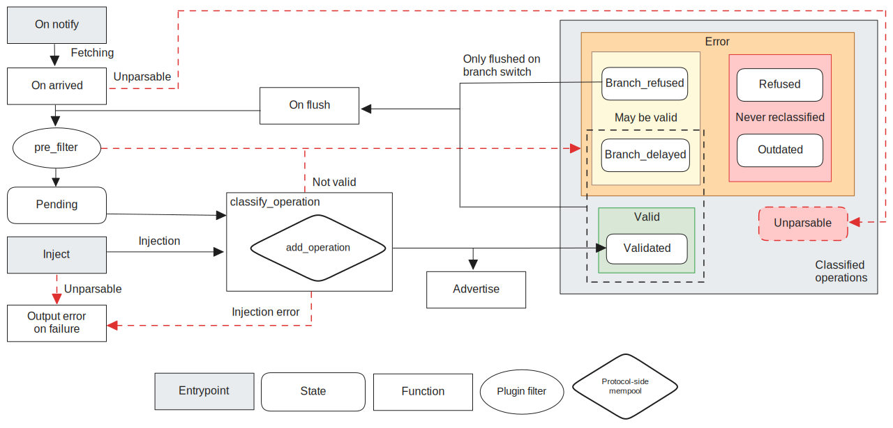

The Prevalidator
================

The *prevalidator* is responsible for determining which operations to propagate
over the gossip network. It relies on the economic protocol to classify
operations and decide whether they should be propagated or not.

The baker uses the prevalidator too, via the ``monitor_operations`` RPC, for
selecting operations that can be included in the block being crafted (if any),
and for observing consensus operations/quorums (in particular for the Tenderbake
protocol).

The prevalidator aims to protect the network against DDoS attacks and must
decide which operations to broadcast and which to keep in its bounded memory. To
do so, it maintains a set of operations along with their associated
classifications in a data structure called the (prevalidator) *mempool*. Operations deemed
valid are broadcast and made available for peer requests. Each time the
validation system switches to a new head, the operations classification is
reconsidered through a process known as *flushing*, as previous classification
may become obsolete.

The classification maintained by the prevalidator ensures a strong and usefull
property: the mempool's validated operations are
:ref:`co-validable<co-valid_operations_alpha>`. Any subset of these operations can
be included in the next block in any order, with confidence that they can be
applied to the current ledger without causing errors.

Prevalidator filtering mechanisms
~~~~~~~~~~~~~~~~~~~~~~~~~~~~~~~~~

The prevalidator implements several filtering mechanisms that limit to some
extent the risk of flooding the network. Since the filtering must be done by
looking at the content of an operation, which the prevalidator cannot achieve
solely, it relies on a :doc:`protocol-specific plugin<../alpha/plugins>`, that
follows the shell signatures from the
:package-api:`shell-libs.<octez-shell-libs/Tezos_validation/Protocol_plugin/index.html>`,
and on a :doc:`protocol-side mempool<../alpha/mempool>` data-structure.

An operation is first submitted through the
:package-api:`pre_filter<octez-shell-libs/Tezos_validation/Protocol_plugin/module-type-T/Plugin/index.html#val-pre_filter>`
provided by the :doc:`plugin<../alpha/plugins>`. If it passes without being
classified as an error, the prevalidator queries the :package-api:`protocol-side
mempool
data-structure<octez-shell-libs/Tezos_validation/Protocol_plugin/module-type-T/Mempool/index.html>`
to assess the possibility of :package-api:`adding the
operation<octez-shell-libs/Tezos_validation/Protocol_plugin/module-type-T/Mempool/index.html#val-add_operation>`
to the current set of validated operations. If the operation is not classified
as an error, then it is considered valid and broadcasted to peers.

The ``pre_filter`` is executed for each operation received from the network and
every time an operation needs to be reclassified (after receiving a new block
for example). This function should be quick to execute and static: rejection is
done solely based on the content of the operation, not taking into account the
state of the ledger. A detailed description is given in the dedicated plugin
page for the corresponding economic protocol (e.g., :doc:`../active/plugins` for
the active protocol).

The protocol-side mempool scrutinizes the operation in greater detail. It
ensures that the operation does not conflict with any already validated
operations to maintain co-validity. In case of a conflict, the protocol may
either reject the new operation or accept it while reclassifying previously
validated operations out of the validated set (see
:doc:`../alpha/mempool`).

The number of valid operations in the prevalidator mempool is limited to a
maximum of ``max_operations``, and the total byte size of these operations
cannot exceed ``max_total_bytes``. If the mempool is full, the prevalidator may
prioritize a new operation over an already validated one based on their
fee-to-gas ratio. These values can be accessed and configured via
:ref:`RPCs<active_filter_rpc_alpha>`.

Pending operations ordering and prioritization
~~~~~~~~~~~~~~~~~~~~~~~~~~~~~~~~~~~~~~~~~~~~~~~

The prevalidator leverages additional information provided by the ``pre_filter``
to sort operations. This results in a finer-grained ordering, where consensus
and freshly injected operations are prioritized over others.

.. _operation_classification:

Operations classification
~~~~~~~~~~~~~~~~~~~~~~~~~~~~~~~~

The Octez prevalidator classifies an operation based on its validity in the
prevalidator's current state:

- ``Valid``: the operation was successfully validated by the protocol. A
  validated operation is guaranteed to be applied successfully on the current
  context even though the operation has not been applied.
- ``Branch_delayed``: the operation could not be applied on the current context,
  but could be in the future.
- ``Branch_refused``: the operation could not be applied on the current context,
  but could be if a reorganisation happens.
- ``Outdated``: this operation will never be applicable in the future but was
  valid in the past.
- ``Refused``: There is no block on the current economic protocol that would
  accept this operation.

When a node switches to a new head, its prevalidator state is reset accordingly.
Operations that were previously classified as ``Valid`` are marked as ``pending``
awaiting to be reclassified. Depending on the relationship between the current
block and the previous one, ``Branch_delayed`` or ``Branch_refused`` operations
might also be reconsidered and marked as ``pending`` (i.e. ``Branch_delayed`` are
reclassified when the new head is a successor of the previous one, while
``Branch_refused`` operations are reclassified if the current head is on a
different branch).

Operations living in the prevalidator (already classified or not) can be
accessed via the ``pending_operations`` RPC.

The journey of an operation can be outlined as follows:

- When advertised from peers, an operation is first known by its hash before
  its content is retrieved from the peer if necessary. Once an operation
  content is fetched, it is marked as ``arrived`` and is submitted to the
  ``pre_filter``. If prefiltered without errors, the operation is assigned a
  priority based on its validation passes and fee/gas ratio. It is then marked
  as ``pending`` and await to be classified with help of the :doc:`protocol-side
  mempool<../alpha/mempool>`. After classification, it is marked as
  classified and sorted accordingly, remaining there until the next
  prevalidator flush. If classified as ``Valid``, the operation is advertised to
  peers.

- On injection, an operation bypasses prefiltering and is submitted directly to
  the protocol-side mempool. As for operations received from peers, they will be
  broadcast to the network if classified as ``Valid``. Otherwise, unlike
  operations received form the network, they will not be classified, and an error
  will be output to inform the user.

The following diagram illustrates the lifecycle of an operation through the
prevalidator, from its arrival or injection to its advertising and
classification.

   Lifecycle of an operation, including entry points, states, and processing steps

.. _one_manager_op_per_manager_per_block:

One manager operation per manager per block
~~~~~~~~~~~~~~~~~~~~~~~~~~~~~~~~~~~~~~~~~~~

The prevalidator ensures that at most one manager operation per manager is
classified as ``Valid`` at any given time. All other operations received from
the same manager will be classified as ``Branch_delayed`` and will not be
propagated until the ``Valid`` operation is cleared. This restriction simplifies
maintaining the co-validity property and thereby speeds up the prevalidator.

Replacing by fee
~~~~~~~~~~~~~~~~

Alternatively, a user can inject an operation with the same manager and the same
counter, but with a higher fee to replace an already existing operation in the
mempool. Only one of the two operations will be eventually included in a
block. To be able to replace the first operation, the fee and the "fee/gas
limit" ratio of the second one is supposed to be higher than the first's by a
factor. This factor can be configured via the ``replace_by_fee`` (see
:ref:`filter RPCs<active_filter_rpc_alpha>`) parameter of the filter
configuration of your node. In case of successful replacement, the old operation
is re-classified as ``Outdated``.

Concretely, a user can replace a successfully classified manager operation in the
mempool, with the help of ``octez-client``, using two methods :

- manually provide a higher fee to bump the "fee/gas limit" ratio by at least 5% for the new
  operation,
- via option ``--replace``: In this case, ``octez-client`` will automatically
  compute the minimal amount of fee for the second operation to be able to
  replace the one in the mempool.

Banning operations
~~~~~~~~~~~~~~~~~~~

To remove an injected operation that has not yet been included in a block, one
can ban an operation via the ``ban_operation`` RPC. The operation won't be
considered again until unbanned via the ``unban_operation`` or
``unban_all_operations`` RPCs. The prevalidator will reconsider other
operations from the same manager that could have been blocked by the banned one,
and can lead to the advertisement of one of them. Note that banning is local to
your node, meaning that peers won't be informed in any way. In particular, if
the banned operation has already been advertised to peers, and that your local
node advertises a new manager operation that is conflicting with the former,
peers will classify the latest ``Branch_delayed`` if they hold the former in
their mempool.
