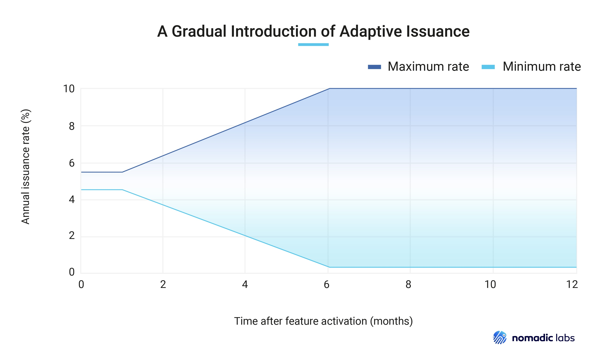

:math:`\newcommand\F[2]{\mathit{#1}\left(#2\right)}`
:math:`\newcommand\IL[1]{\normalsize{#1}}`
:math:`\newcommand\exp[1]{\F{exp}{#1}}`

.. _adaptive_issuance:
.. _adaptive_issuance_tallinn:

=================
Adaptive Issuance
=================

Adaptive Issuance is a novel mechanism regulating tez issuance in Tezos.

The :doc:`Tezos economic protocol <./protocol>` issues new
tez via:

-  Participation rewards: incentives given to delegates for
   :doc:`participation in consensus <consensus>`
   and random seed generation.
-  The :doc:`Liquidity Baking (LB) subsidy <liquidity_baking>`.
-  Protocol "invoices": lump sums of tez issued and allocated during
   protocol migration.

Participation rewards and the LB subsidy are regularly issued by the
protocol, whereas the value and recipients of invoices are defined
discretionarily by the developers of a protocol proposal.
The values for participation rewards and
the LB subsidy, if any, are currently defined by the Tezos protocol using fixed
constants.

Adaptive Issuance lets the amount of participation rewards depend on
the global **staked ratio** – that is, the
ratio of staked tez to the total supply. This lets issuance roughly
match the *actual* security budget the chain requires, the amount needed
to encourage participants to stake and produce blocks, but *no more*.

At the end of each blockchain :ref:`cycle <def_cycle_tallinn>`, the
regular issuance is adjusted, to nudge the staked ratio towards a
protocol-defined target (set at 50% starting in the Paris
protocol). Participation rewards are recomputed to match that
budget. When the staked ratio decreases and diverges from the target,
emission rates increase, incentivizing participants to stake funds to
re-approach the target. Conversely, incentives decrease as the ratio
increases beyond the target.

.. _adaptive_issuance_rate:
.. _adaptive_issuance_rate_tallinn:

Adaptive issuance rate
----------------------

The adaptive issuance rate determines, at the end
of cycle :math:`\IL{c}`, the issuance for cycle :math:`\IL{c + 3}`. The
adaptive issuance rate is the sum of a :ref:`static rate <static_rate_tallinn>`
and a :ref:`dynamic rate <dynamic_rate_tallinn>`. This value is kept within
a minimal and a maximal value, to ensure nominal emissions remain within
reasonable bounds.

.. _staked_ratio:
.. _staked_ratio_tallinn:

Staked ratio
............

The **staked ratio** is the ratio of staked tez to the total supply. It is computed at the end of a given ``cycle``:

.. code-block:: python

  def staked_ratio(cycle):
    return total_frozen_stake(cycle + 1 + issuance_modification_delay) / total_supply(cycle)

Where:

- ``issuance_modification_delay`` is a :ref:`derived protocol
  constant<protocol_constants_tallinn>` which is set to the same value
  as ``CONSENSUS_RIGHTS_DELAY`` (see :ref:`active_stake_tallinn`), that
  is, 2 cycles.

- ``total_supply(cycle)`` returns the total supply of tez at the end of the given ``cycle``.
- ``total_frozen_stake(cycle)`` returns the total frozen stake at the given ``cycle``.

.. _static_rate:
.. _static_rate_tallinn:

Static rate
...........

The **static rate** is a mechanism which approximates `a Dutch
auction <https://en.wikipedia.org/wiki/Dutch_auction>`__ to compute a
nominal issuance rate as a function of the staked ratio for a
given cycle. Its value decreases as the staked ratio increases.
The static rate is defined as follows:

.. code-block:: python

  def static_rate(cycle):
    return 1 / 1600 * (1 / (staked_ratio(cycle) ** 2))

The choice of a scaling factor ensures that the curve takes reasonable values for plausible staked ratios. Moreover, since Adaptive Issuance is activated with a dynamic rate of 0, and at current staked ratio (that is, ~7.5% of the total supply), this factor allows for a smooth transition from the issuance rate (~4.6%) from the Oxford protocol (before the activation of Adaptive Issuance).

.. _dynamic_rate:
.. _dynamic_rate_tallinn:

Dynamic rate
............

The **dynamic reward rate** adjusts itself over time based on the distance between the staked ratio and the 50% (±2%) target ratio, increasing when < 48% and decreasing when > 52%. The dynamic rate is defined as follows:

.. code-block:: python

  def dynamic_rate(cycle):
    seconds_per_cycle = blocks_per_cycle * minimal_block_delay
    days_per_cycle = seconds_per_cycle / 86400
    previous_dynamic = dynamic_rate(cycle - 1)
    staked_ratio = staked_ratio(cycle)
    if staked_ratio < 0.48:
      delta_d = (0.48 - staked_ratio) * growth_rate * days_per_cycle
    elif staked_ratio > 0.52:
      delta_d = (0.52 - staked_ratio) * growth_rate * days_per_cycle
    else:
      delta_d = 0
    return previous_dynamic + delta_d

Where:

- ``blocks_per_cycle`` denotes the number of blocks in a Tezos cycle.
- ``minimal_block_delay`` denotes the minimal duration of a block in seconds.
- ``days_per_cycle`` denotes the minimal duration in days of a Tezos cycle, assuming all blocks in the cycle are produced at the minimal allowed time – that is, every ``minimal_block_delay`` seconds.
- ``growth_rate`` controls the speed at which the dynamic rate adjusts. The value is set so that a one percentage point deviation of the staked ratio changes the dynamic rate by 0.01 percentage points per day.

In a nutshell, ``dynamic_rate(c)`` increases and decreases by an amount proportional to the distance between the target rate and the interval ``[48%; 52%]``. Note that to ensure that the issuance rate is kept within :ref:`the minimum and maximum bounds <minimum_and_maximum_rates_tallinn>`, the dynamic rate might be adjusted accordingly. More precisely, if :ref:`the issuance rate <issuance_rate_tallinn>` would surpass the maximum issuance allowed for a given cycle, then ``dynamic_rate(c)`` would be reduced to keep the issuance rate within the bounds (this part of the formula has been omitted from the above pseudocode for brevity).

.. _minimum_and_maximum_rates:
.. _minimum_and_maximum_rates_tallinn:

Minimum and maximum rates
..........................

Starting in Paris, the minimum and maximum
issuance rates will evolve slowly over a set period of time,
so that the range of possible issuance rate values widens progressively.

The following figure describes the progressive maximum and minimum
values of Adaptive Issuance.

 Figure 1. A gradual widening of the range ensures a smooth transition
 to Adaptive Issuance.

The schedule consists of three periods:

- an **initial** period, set to 1 month, where the minimum and maximum
  issuance rates are close to the issuance rate from the Oxford
  protocol (before the activation of Adaptive Issuance) and stay
  constant,
- a **transition** period, set to 5 months, where they evolve linearly, with
  a decreasing minimum, and an increasing maximum, and
- a **final** period where the minimum and maximum have reached their
  final values.

Formally, the functions for the minimum and maximum values are piecewise linear functions of time,
and can be generally defined as follows:

.. code-block:: python

  def compute_extremum(cycle, initial_value, final_value):
    trans = transition_period + 1
    initial_limit = ai_activation_cycle + initial_period
    trans_limit = initial_limit + trans
    if cycle <= initial_limit:
        return initial_value
    elif cycle >= trans_limit:
        return final_value
    else:
        t = cycle - initial_limit
        res = (t * (final_value - initial_value) / trans) + initial_value
        return res

Where:

- ``ai_activation_cycle`` is the first cycle with Adaptive Issuance
  active, which was cycle 748 on mainnet.
- ``initial_period`` is a predefined period of time, set to 1 month in Paris.
- ``transition_period`` is a predefined period of time, set to 5 months in Paris.

The issuance minimum rate for Adaptive Issuance curve is then defined as follows.

.. code-block:: python

  def minimum_rate(cycle):
    return compute_extremum(cycle, issuance_initial_min, issuance_global_min)

Where:

- ``issuance_initial_min`` (4.5%) is the initial minimum
  value. The issuance rate is kept
  above this bound for the initial period.
- ``issuance_global_min`` (0.25%) is the final value for the lower bound, reached at the end of the transition period.

The issuance maximum rate for Adaptive Issuance curve is then defined as follows.

.. code-block:: python

  def maximum_rate(cycle):
    return compute_extremum(cycle, issuance_initial_max, issuance_global_max)

Where:

- ``issuance_initial_max`` (5.5%) controls the initial maximum
  value. The issuance rate is kept
  below this bound for the initial period.
- ``issuance_global_max`` (10%) is the final value for the upper bound, reached at the end of the transition period.

.. _adaptive_maximum:
.. _adaptive_maximum_tallinn:

Adaptive Maximum
................

In addition to the issuance bounds described above, the Quebec protocol introduces
another upper bound on the total issuance rate. This new bound, called
**adaptive maximum**, prevents the issuance rate from taking
undesirably high values when the staked ratio of the chain is already
close to the 50% target.

The adaptive maximum is defined as a function of the staked ratio that
decreases smoothly as the staked ratio grows closer to the 50% target,
down to a 1% maximal issuance rate when the staked ratio is at 50% or
above. See the blue curve on Figure 2, as well as a few sample values
in Figure 3. The exact formula is provided further below.

Thanks to the adaptive maximum, the total issuance rate (static rate +
dynamic rate) cannot be too far above the static rate (green dashed
curve). More precisely, the total issuance rate is forced to stay
between the static rate (green) and the adaptive maximum (blue). In
other words, the dynamic rate is effectively bounded to stay below the
red dotted curve, which plots the adaptive maximum minus the static
rate. Note that this no longer holds if the adaptive maximum gets
overridden by the minimum issuance, as discussed below.

.. figure:: adaptive_maximum.png

  Figure 2. Adaptive maximum compared to the static rate, in the range from 5% to 50% staked ratio.

.. list-table:: Figure 3. Adaptive maximum: a few data points.

   * - Staked ratio
     - 5% and below
     - 10%
     - 20%
     - 30%
     - 40%
     - 50% and above
   * - Adaptive maximum issuance (approx.)
     - 10%
     - 9.2%
     - 5.6%
     - 3%
     - 1.5%
     - 1%

The function that defines the adaptive maximum is:

.. code-block:: python

  def adaptive_maximum(r): # r is the staked ratio of the chain
    if r >= 0.5:
      return 0.01
    elif r <= 0.05:
      return 0.1
    y = (1 + 9 * ((50 - 100 * r) / 42 ) ** 2 ) / 100
    if y > 0.1:
      return 0.1
    elif y < 0.01:
      return 0.01
    else:
      return y

.. note::

  Until the final value of the :ref:`minimum
  rate<minimum_and_maximum_rates_tallinn>` is reached, it is possible,
  with a high enough staked ratio, for the corresponding adaptive
  maximum to be smaller than the minimum rate. If this happens, then
  the minimum rate takes priority, that is, the total issuance rate
  (static + dynamic) is set to the minimum rate exactly. This way, the
  total issuance rate is as close to the adaptive maximum as can be
  while fully satisfying the minimum rate.

.. _issuance_rate:
.. _issuance_rate_tallinn:

Issuance rate
......................

Finally, as mentioned before, the nominal adaptive issuance rate [1]_
for a cycle ``c + issuance_modification_delay + 1`` is defined as the sum
of the static rate and the dynamic rate computed for the cycle ``c``,
bounded within the :ref:`minimum and maximum rates
<minimum_and_maximum_rates_tallinn>`, along with the :ref:`adaptive
maximum <adaptive_maximum_tallinn>`, computed for the cycle ``c + 1``.

.. code-block:: python

  def issuance_rate(cycle):
    adjusted_cycle = cycle - issuance_modification_delay
    static_rate = static_rate(adjusted_cycle - 1)
    dynamic_rate = dynamic_rate(adjusted_cycle - 1)
    minimum_rate = minimum_rate(adjusted_cycle)
    maximum_rate = min(maximum_rate(adjusted_cycle), adaptive_maximum(stake_ratio(adjusted_cycle)))
    total_rate = static_rate + dynamic_rate
    return max( min(total_rate, maximum_rate), minimum_rate )

.. _adaptive_rewards:
.. _adaptive_rewards_tallinn:

Adaptive rewards
----------------

Before Adaptive Issuance activation,
participation rewards were fixed values defined by protocol
constants. With the new mechanism, the adaptive issuance rate provides
instead a budget for the whole cycle, which gets allocated equally to
each block of the cycle and distributed between the various rewards,
in proportion to their relative :ref:`weights
<rewards_weights_tallinn>`.

.. _rewards_weights:
.. _rewards_weights_tallinn:

Reward weights
..............

The weights for participation rewards are defined as:

- Attestation rewards: 10,240.
- Fixed baking reward: 5,120.
- Bonus baking reward: 5,120.
- DAL rewards: 2,275.
- Nonce revelation tip: 1.
- VDF tip: 1.

The total sum ``sum_rewards_weight`` of all weights is 22,757.

.. code-block:: python

  sum_rewards_weight = (
    attestation_rewards +
    fixed_baking_rewards +
    bonus_baking_rewards +
    dal_rewards +
    nonce_revelation_tip +
    vdf_tip)

The coefficient to apply for reward computation is defined as follows.

.. code-block:: python

  def reward_coeff(cycle):
    rate = issuance_rate(cycle)
    total_supply = total_supply(cycle - issuance_modification_delay - 1)
    return (rate / 525600) * total_supply / base_total_issued_per_minute

Where:

- ``base_total_issued_per_minute`` (80007812) is the expected amount of mutez issued per minute.
- 525600 is the number of minutes per year.

The issuance per block is then distributed amongst the different rewards in proportion to their weight.

.. code-block:: python

  def tez_from_weights(weight):
    num = weight * minimal_block_delay
    den = sum_rewards_weight * 60
    return base_total_issued_per_minute * num / den

  def reward_from_constants(cycle, weight):
    return tez_from_weights(weight) * reward_coeff(cycle)

**Consensus rewards.** Since the adoption of Tenderbake, Tezos
protocols before Paris have rewarded delegates :doc:`for their
participation in consensus <consensus>` with the following rewards per
block:

-  A fixed **baking** reward, given to the delegate which produced the
   *payload* of the block (i.e. choosing transactions, and other
   non-consensus operations).
-  A variable, baking **bonus** reward given to the delegate which
   produced the block included in the chain. This bonus is given for
   including attestations, if their combined attesting power exceeds the
   minimal threshold (two thirds of total slots).
-  A *collective* **attestation** reward, for attesting block proposals,
   distributed at the end of the cycle to the delegates selected in the
   consensus committees for that cycle, proportionnaly to their expected
   participation.

We refer to :doc:`the consensus page <consensus>` for
further insight on the pre-requisites and distribution of these rewards.
Here, we derive the new functions which compute their values per block.

.. code-block:: python

  def baking_reward_fixed_portion(cycle):
    return reward_from_constants(cycle, fixed_baking_rewards)

  def baking_reward_bonus_per_slot(cycle):
    bonus_committee_size = consensus_committee_size - consensus_threshold
    return reward_from_constants(cycle, bonus_baking_rewards) / bonus_committee_size

  def attestation_reward_per_slot(cycle):
    return reward_from_constants(cycle, attestation_rewards) / consensus_committee_size

Where:

- ``consensus_committee_size`` (7000) is the number of attestation slots available in a block.
- ``consensus_threshold`` (4667) is the required number of attestations for a baker to propose a block.

**Nonce and VDF revelation tips.** The rewards allocated to delegates
for contributing to :ref:`random seed generation <randomness_generation_tallinn>`
(that is, for revealing nonce seeds and posting VDF proofs) are not paid
each block, but rather every 192 blocks.

.. code-block:: python

  def seed_nonce_revelation_tip(cycle):
    return reward_from_constants(cycle, nonce_revelation_tip * blocks_per_commitment)

  def vdf_revelation_tip(cycle):
    return reward_from_constants(cycle, vdf_tip * blocks_per_commitment)

Where:

- ``blocks_per_commitment`` (112) is the interval in blocks between each revelation, both VDF and nonce.

The `RPC endpoint
<https://octez.tezos.com/docs/active/rpc.html#get-block-id-context-issuance-expected-issuance>`__,
``/issuance/expected_issuance`` reports the precomputed values of all
participation rewards for the provided block and the next
``issuance_modification_delay`` cycles.

.. [1]
   Note that if the nominal annual issuance rate is :math:`r`, the
   annualized rate is close to :math:`\IL{\exp{r} - 1}` as it is
   compounded at every cycle.
