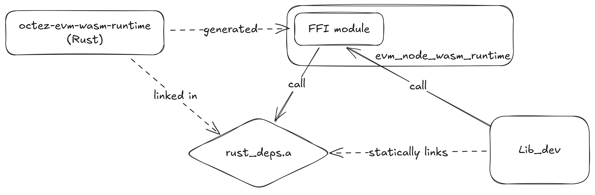

# A WASM Runtime for the EVM Node

- The `octez-evm-node-wasm-runtime` crate is the place where the WASM Runtime
  (in Rust) is implemented.
- We add a `build.rs` script to generate an OCaml module allowing to call the
  FFI functions exposed by `ocaml-rs`. The resulting module is exported as part
  of the `evm_node_wasm_runtime` library. The module needs to be generated
  manually, and the script `lint.sh` allows anyone to verify the files in
  `ocaml-api` are up-to-date.
- We add `octez-evm-node-wasm-runtime` to the `rust_deps` crate. This means
  the WASM Runtime will be part of the `.a` static library generated by this
  crate. Since this static library is already used by the EVM node, this is
  enough to make the WASM Runtime available to the EVM Node library.

