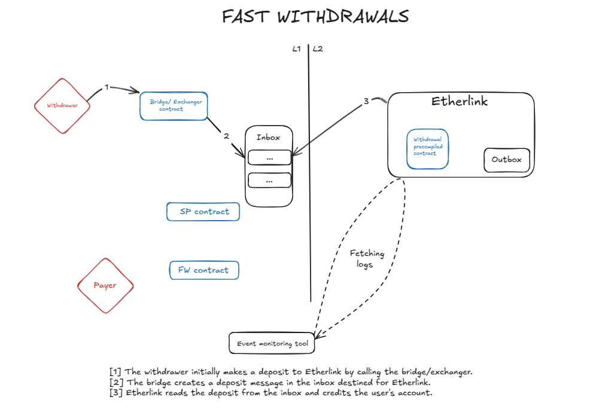
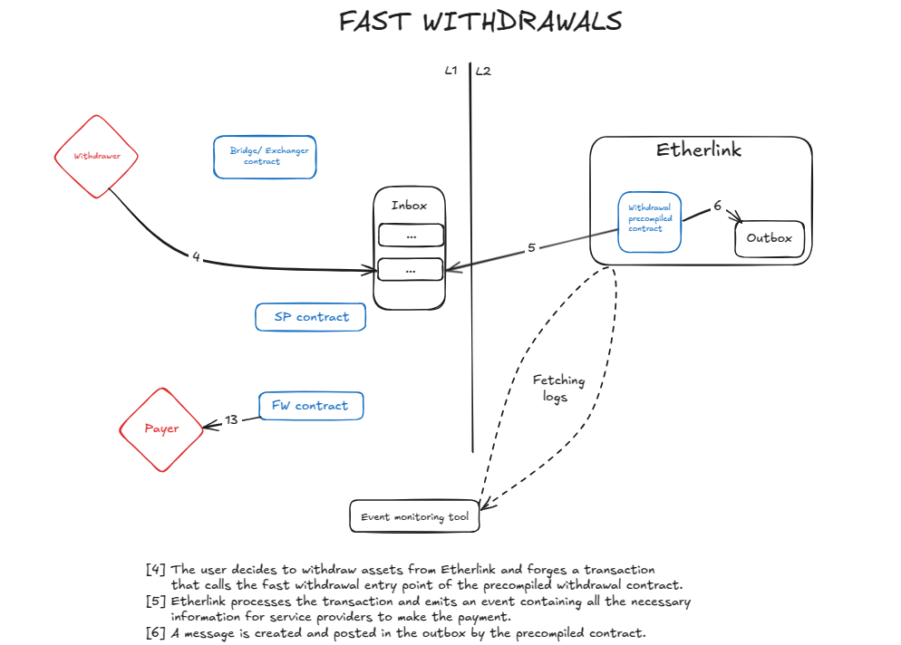
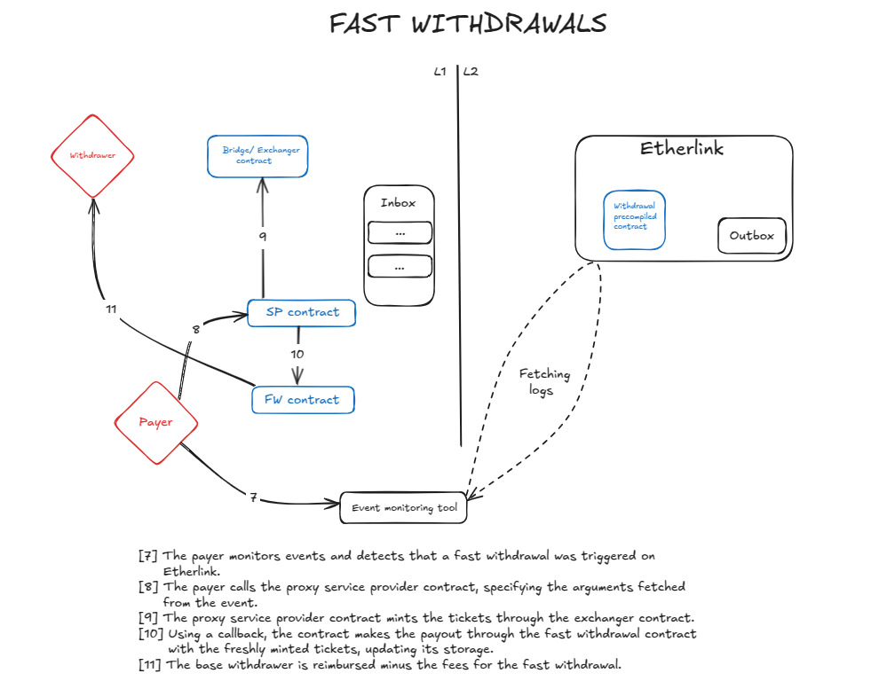
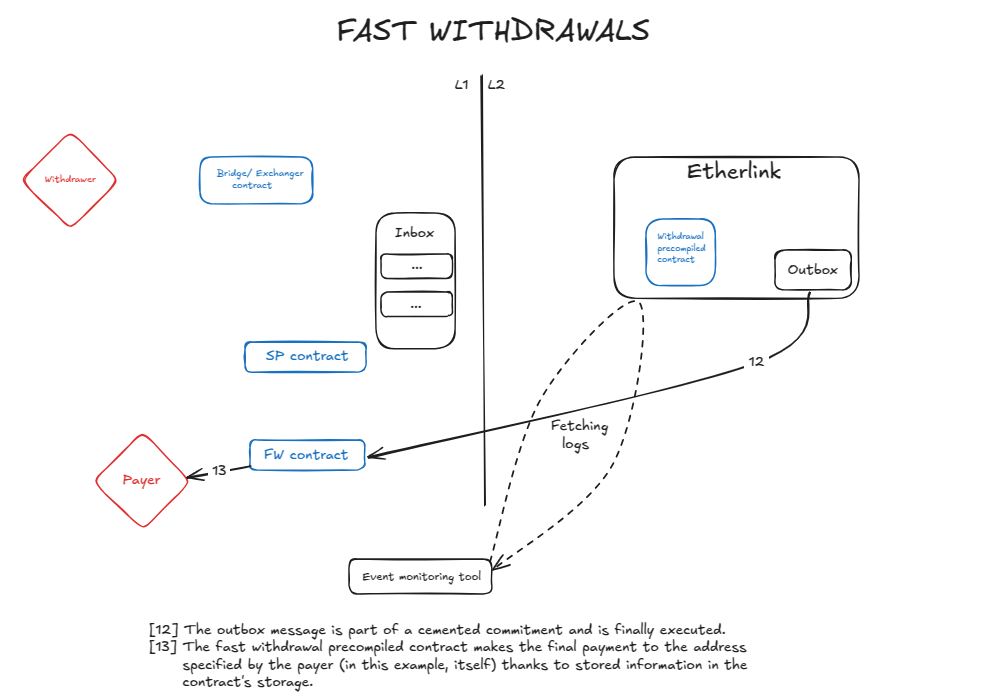

# EVM L1 bridge smart-contract

This folder contains the EVM L1 bridge smart contract used to deposit CTEZ to
an EVM rollup, but also to withdraw it.

## How to use

- Compile the contract:
```
$ ligo compile contract evm_bridge.mligo -o evm_bridge.tz
```
- Originate the smart-contract:
```
$ ./octez-client originate contract evm-bridge transferring 0 from <src> running etherlink/tezos_contracts/evm_bridge.tz --init '(Pair (Pair "<admin>" "<ctez-contract>")  None)'
```
- Set the EVM rollup target:
```
$ ./octez-client transfer 0 from <admin> to evm-bridge --entrypoint "set" --arg '"<sr1>"' --burn-cap 0.00675
```

## Fast Withdrawals Workflow

**NB**: Some interactions were intentionally omitted to facilitate overall comprehension.
The sequencer is omitted here as it is irrelevant to the core mechanism of the
fast withdrawal feature for instance.





