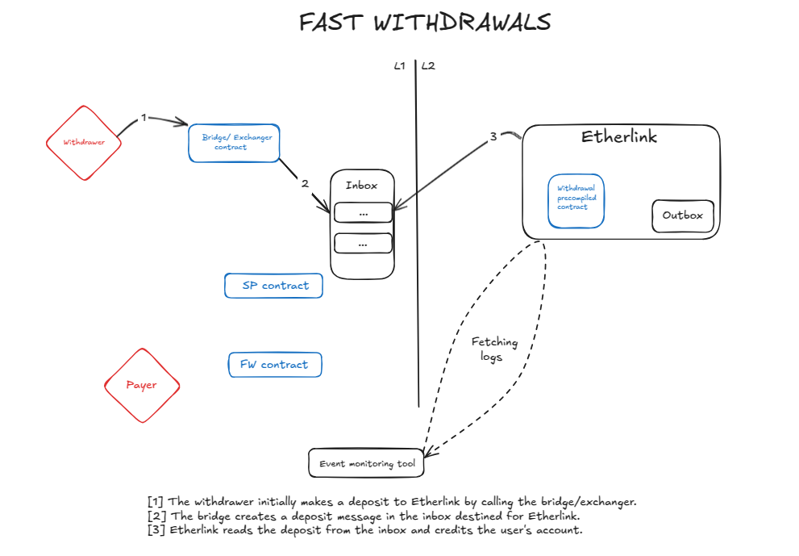
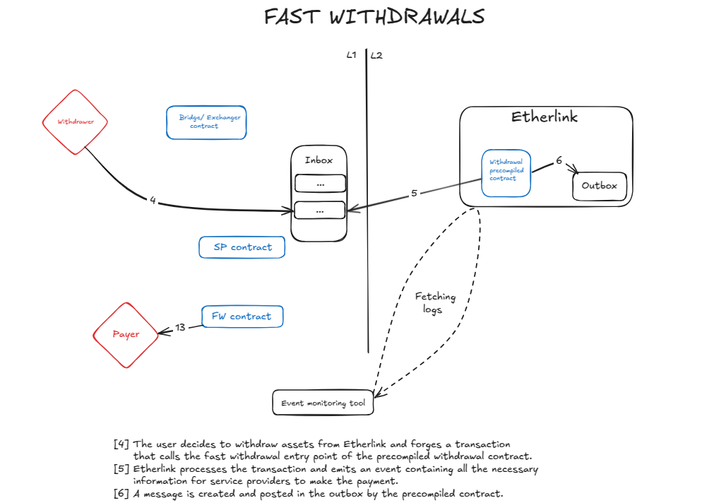
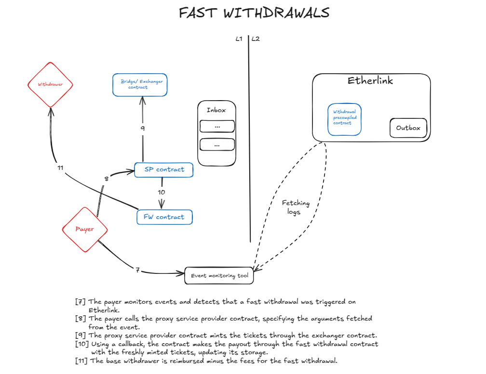
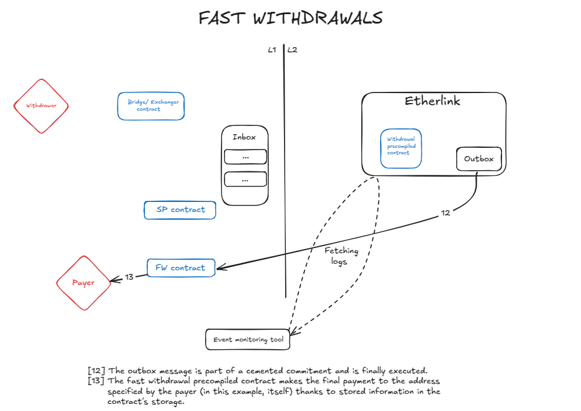

# Fast Withdrawal Contract

This directory contains the Tezos L1 contract that supports **fast withdrawals**
from Etherlink to Tezos L1. It is a component of the [Etherlink
Bridge](https://bridge.etherlink.com/) and is designed to let service providers
pay users immediately on Tezos, then later reclaim the full amount.

Providers pay the user on Tezos and later reclaim the full amount when the
Etherlink smart rollup finalizes the corresponding outbox message, typically
after about two weeks.

The files here were extracted from the [etherlink-bridge
repository](https://github.com/baking-bad/etherlink-bridge/tree/main/tezos/contracts/fast-withdrawal),
at commit
[`be1eb8874387ae9a1f3449ef56237ba2c022c2f9`](https://github.com/baking-bad/etherlink-bridge/tree/be1eb8874387ae9a1f3449ef56237ba2c022c2f9).
The repo contains the full context, including build and test scripts.

The contract
[`KT1BGwyCrnJ6HuEYP7X8Q2UooTdxmEYHiK6j`](https://tzkt.io/KT1BGwyCrnJ6HuEYP7X8Q2UooTdxmEYHiK6j/operations)
is currently serving fast withdrawals for Etherlink. Note however that the
contract deployed is not identical to the one from the repo as it was most
likely compiled by a different version of the Ligo compiler. Pinning the Ligo
version was introduced in the repo later. The two contracts should be
semantically equivalent.

The audit report for the contract is available
[here](https://github.com/etherlinkcom/audit/blob/main/Fast-Withdrawals/Inference%20-%20Etherlink%20-%20tez%20fast%20withdrawal%20bridge%20-%20v1.0.pdf).

This service-provider folder contains a contract implementation
[`service-provider.mligo`](service-provider/service-provider.mligo) that is only
used for integration tests for fast withdrawals and not part of the original
repo.

## Building

```bash
make compile
```

## Workflow

**Note:** Some interactions are intentionally omitted to keep the workflow easy
to follow. For example, the sequencer is omitted because it is not essential to
understanding the core fast withdrawal mechanism.





