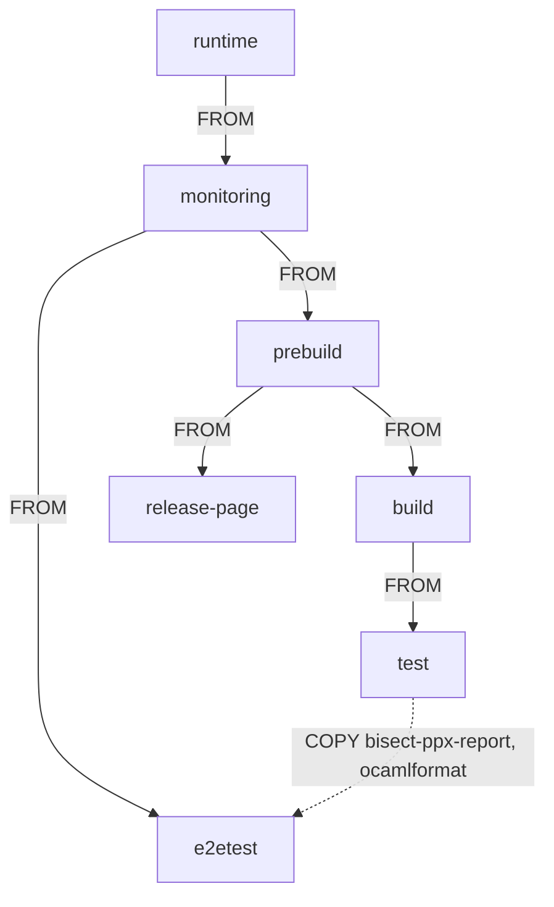

# Octez base Docker images

This directory contains different Docker images and artefacts used in
[Octez](https://gitlab.com/tezos/tezos) CI jobs:

- `zcash-params/` contains the Sapling parameters
- `scripts/` contains miscellaneous scripts

## Dockerfiles

The images defined in this directory are used in the CI pipelines of
[Octez](https://gitlab.com/tezos/tezos), and as base images for the
[Octez Docker distribution](https://hub.docker.com/r/tezos/tezos).

All images except `e2etest`, are built on top of each
other, such that the contents of image N is also in N+1[^1]. The image
`e2etest` is built on top of
`monitoring` and additionally copies some binaries from
`build`:

The images, their content and intended usage, are:

| Image         | Contents                           | Usage                             |
|---------------|------------------------------------|-----------------------------------|
| `runtime`     | runtime libraries + zcash-params   | distributing Octez executables    |
| `monitoring`  | datadog-ci (via npm)               | base image to instrument CI jobs  |
| `prebuild`    | OCaml + opam package cache + Cargo | CI: OPAM installability tests     |
| `build`       | opam packages                      | CI: Building Octez                |
| `release-page`| OCaml + release-page dependencies  | CI: Building Octez release page   |
| `test`        | Python + NVM + ShellCheck          | CI: Octez tests and documentation |
| `e2etest`     | `eth-cli` + `solc` + cast          | CI: Octez integration tests       |

For more details on the contents and usage of each image, see the
header comment of each corresponding layer in the Dockerfile.

## Adding OPAM dependencies

The images built in this repository are used to in the CI of
[tezos/tezos](https://gitlab.com/tezos/tezos). To update the
dependencies for `tezos/tezos`, these images have to be modified. For an
in-depth guide, see the Tezos technical documentation's guide on [how
to add or update opam
dependencies](https://tezos.gitlab.io/developer/contributing-adding-a-new-opam-dependency.html).

## Poetry files

`poetry.lock` and `pyproject.toml` defines the Python environment used
to build the Octez documentation. This environment is installed in the
image `test` and used in the Octez CI to
build documentation.

[^1]: There are exceptions. For instance, the
    `prebuild` image contains the sources of the
    OPAM packages from `packages/`, which are used in the `opam` tests
    of `tezos/tezos`. However, they serve no use and are not present
    in the images that build on top of it
    (`build` etc).
